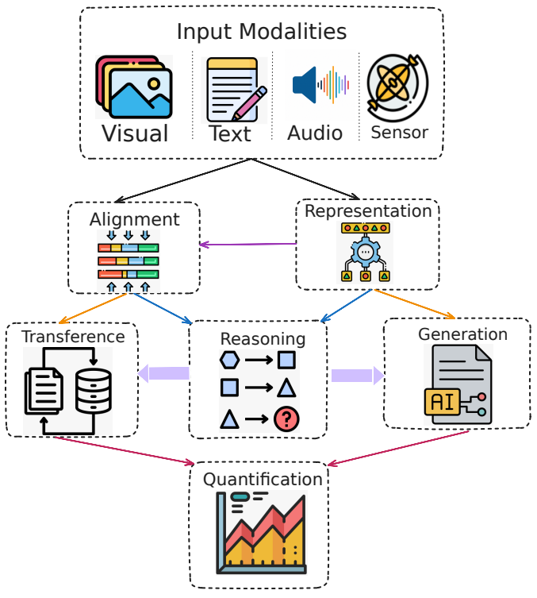

# 📚 \[11] Ollama 설치



## 0. 대형 언어 모델(LLM) 향상하기

기본적으로 LLM은 학습 중에 배운 내용만 알고 있습니다. 실시간 또는 개인 데이터를 추가하여 더 유용하게 만들 수 있습니다.

데이터를 추가하여 모델을 향상시키는 두 가지 주요 방법은 다음과 같습니다.

* **RAG(검색 보강 생성)**: 의미 체계 검색 및 상황별 초기화를 사용하여 모델 답변 전에 유용한 정보를 찾고 추가합니다.
* **파인 튜닝:** 더 작은 특정 데이터 세트에서 LLM을 재학습하여 특정 작업 또는 토픽에서 더 나은 성능을 얻습니다.

### 0.1 RAG (검색 보강 생성) 이해하기

RAG는 **"내 데이터를 통해 채팅"** 시나리오를 가능하게 합니다. 조직이 보유한 문서, 설명서, 기타 독점 데이터와 같은 텍스트 콘텐츠 모음을 사용하여 사용자 프롬프트에 대한 답변의 근거로 활용합니다.

#### 작동 방식

<figure><figcaption></figcaption></figure>

RAG를 사용하여 챗봇을 구축하는 기본 흐름은 다음과 같습니다.

1. **데이터 저장**: 데이터베이스에 문서(또는 **청크**라고 함)를 저장합니다.
2. **임베딩 생성**: 각 청크에 대한 임베딩(Embeddings)을 만듭니다. 이는 텍스트의 의미를 나타내는 숫자 목록(벡터)입니다.
3. **유사도 검색**: 사용자가 질문을 하면 시스템에서 벡터 데이터베이스를 통해 비슷한 청크를 찾습니다.
4. **답변 생성**: 질문과 함께 찾아낸 관련 청크를 LLM에 보내 답변을 생성합니다.

#### 벡터화와 임베딩 (Embeddings)

<figure><figcaption></figcaption></figure>

임베딩은 단어, 문장 또는 문서의 **의미**를 컴퓨터가 이해할 수 있는 숫자로 변환하는 과정입니다. 예를 들어 Azure OpenAI Embeddings API 등을 사용하면 텍스트의 주제, 의미, 문법, 스타일 등을 다차원 공간의 좌표로 변환할 수 있습니다.

* **코사인 유사성(Cosine Similarity)**: 두 벡터(질문과 문서) 사이의 각도를 측정하여 얼마나 유사한지 판단합니다. 값이 1에 가까울수록 매우 유사함을 의미합니다.

#### RAG의 과제 및 고려 사항

* **데이터 개인 정보**: 외부 원본이나 내부 독점 데이터를 처리할 때 보안에 유의해야 합니다.
* **계산 요구 사항**: 검색 및 생성 단계가 모두 중요한 컴퓨팅 리소스를 사용할 수 있습니다.
* **정확도**: 검색된 정보의 정확성이 최종 답변의 품질을 결정합니다.

### 0.2 모델 미세 조정 (Fine-tuning)

파인 튜닝은 대규모 일반 데이터 세트에 대한 초기 학습 후, **더 작은 도메인별 데이터 세트**에서 LLM을 다시 학습시키는 과정입니다.

#### 주요 개념

사전 학습된 모델은 일반적인 언어 구조를 이미 알고 있습니다. 미세 조정은 이 모델에 새로운 포커스(특정 작업이나 토픽)를 맞추도록 가중치를 업데이트합니다.

#### 파인 튜닝의 주요 이점

1. **전문화**: 법률, 의료 문서 분석 등 특정 도메인 작업을 더 잘 수행합니다.
2. **효율성**: 모델을 처음부터 학습시키는(Pre-training) 것보다 훨씬 적은 데이터와 리소스를 사용합니다.
3. **스타일 적응**: 조직의 특정 어조(Tone)나 응답 형식을 학습시킬 수 있습니다.

#### 제한 사항

* **데이터 요구 사항**: 고품질의 데이터 세트가 필요합니다.
* **과적합(Overfitting) 위험**: 데이터가 적을 경우 모델이 학습 데이터만 기억하고 새로운 데이터에 적응하지 못할 수 있습니다.
* **모델 드리프트**: 특정 작업에 집중하다 보면 일반적인 언어 능력이 저하될 수 있습니다.

### 0.3 RAG와 파인 튜닝 비교 및 선택 가이드

두 방법 모두 LLM의 성능을 높이지만, 해결하고자 하는 문제에 따라 적합한 방법이 다릅니다.

#### 비교 요약

| 구분                    | RAG                          | 파인 튜닝                    |
| --------------------- | ---------------------------- | ------------------------ |
| **데이터 최신성**           | **동적**: 최신 뉴스, 실시간 데이터 반영 가능 | **정적**: 학습 시점의 데이터로 고정됨  |
| **지식 범위**             | 광범위한 외부 지식 활용 가능             | 특정 도메인이나 작업에 깊이 특화됨      |
| **환각(Hallucination)** | 검색된 근거를 제시하여 완화 가능           | 여전히 잘못된 정보를 사실처럼 말할 수 있음 |
| **리소스**               | 벡터 데이터베이스 구축 필요              | 학습을 위한 GPU 등 컴퓨팅 파워 필요   |

#### 어떤 것을 선택해야 할까요?

앱에 필요한 요구 사항에 따라 결정하십시오. **미세 조정은 "전문가"를 만드는 과정**이고, **RAG는 "참고서"를 쥐어주는 과정**입니다. 때로는 두 방법을 결합하여 사용하는 것도 강력한 전략이 될 수 있습니다.

**✅ 미세 조정을 선택해야 하는 경우**

* **작업별 성능**: 특정 형식의 코드 생성, 요약 등 특화된 작업의 결과 품질이 중요할 때.
* **데이터 제어**: 외부로 유출되면 안 되는 독점 데이터를 기반으로 모델 자체를 내재화해야 할 때.
* **안정적인 콘텐츠**: 데이터가 자주 변하지 않고, 모델의 '행동 양식'이나 '말투'를 교정해야 할 때.

**✅ RAG를 선택해야 하는 경우**

* **동적 콘텐츠**: 뉴스, 주식 정보, 사내 공지사항 등 정보가 자주 바뀌는 경우.
* **근거 제시**: 답변이 어디서 왔는지 출처를 명시해야 하는 경우 (팩트 체크가 중요할 때).
* **리소스 효율**: 모델을 재학습시킬 리소스가 부족하고, 기존 모델의 추론 능력만으로 충분할 때.

## 1. Ollama 설치

이 섹션에서는 로컬 환경에서 LLM을 구동할 수 있는 **Ollama**를 설치하고 테스트해봅시다.

### 1.1 Ollama 설치 및 모델 다운로드

#### Download Ollama

```shellscript
sudo apt install curl -y
curl -fsSL [https://ollama.com/install.sh](https://ollama.com/install.sh) | sh
```

#### 모델 저장 위치 설정

기본 경로가 아닌 특정 경로(**예:**`/data/ollama_models`)에 모델을 저장하도록 설정합니다.

**1. 폴더 생성**

```shellscript
mkdir -p /data/ollama_models
```

**2. 권한 설정 (중요!)** Ollama 서비스가 해당 폴더에 접근하고 쓸 수 있도록 권한을 부여해야 합니다. 일반적으로 `ollama:ollama` 소유권을 설정합니다.

```shellscript
sudo chown -R ollama:ollama /data/ollama_models
sudo chmod -R 775 /data/ollama_models
```

**3. 서비스 설정 수정 (systemd)**

```shellscript
sudo systemctl edit ollama.service
```

에디터가 열리면 아래 내용을 복사해서 붙여넣으세요. `[Service]` 섹션 아래에 환경변수를 추가하는 방식입니다.

```shellscript
[Service]
Environment="OLLAMA_MODELS=/data/ollama_models"
```

**4. 서비스 재시작** 설정 파일을 다시 읽어오고 서비스를 재시작합니다.

```shellscript
# 설정 파일 다시 읽기
sudo systemctl daemon-reload

# 서비스 재시작
sudo systemctl restart ollama
```

**5. 확인 및 모델 다운로드** 설정이 제대로 적용되었는지 확인하고 모델을 다운로드합니다.

```shellscript
# 변경된 경로 확인 (Environment 항목에 경로가 보여야 함)
systemctl show ollama.service | grep Environment

# 모델 다운로드 시도 (이제 /data 쪽에 저장됨)
ollama pull qwen3:0.6b
```

**💡 팁**: 모델명 뒤의 `0.6b`에서 **`b`는 Billion(10억)**&#xC744; 의미합니다. 즉, 이 모델은 약 6억 개의 파라미터(매개변수)를 가지고 있다는 뜻입니다. 숫자가 클수록 모델이 똑똑해지지만, 용량이 커지고 실행 속도가 느려지며 더 좋은 컴퓨터 사양이 필요합니다. (예: `7b` = 70억 개 파라미터)

#### 📝 Ollama 기본 명령어 모음

| 명령어                        | 설명           | 비고                        |
| -------------------------- | ------------ | ------------------------- |
| `ollama run <model_name>`  | 모델 다운로드 및 실행 | 실행까지 한 번에 할 때 사용          |
| `ollama pull <model_name>` | 모델만 다운로드     | 당장 실행하지 않고 다운로드만 받아둘 때 사용 |
| `ollama list`              | 모델 리스트 확인    | 현재 내 PC에 설치된 모델 목록 보기     |
| `ollama rm <model_name>`   | 모델 삭제        | 설치된 모델을 지울 때 사용           |

## 2 Ollama 터미널 실습 (CLI)

Python 코드를 짜기 전에, 터미널에서 모델과 직접 대화하며 성능을 확인해 봅니다. `qwen3:0.6b` 모델은 매우 가볍기 때문에 복잡한 논리보다는 **빠른 응답**과 **포맷 준수** 능력을 테스트하는 것이 좋습니다.

```shellscript
ollama run qwen3:0.6b
```

프롬프트가 `>>>` 모양으로 바뀌면 아래 실습들을 진행해 보세요.

#### 실습 1: 한국어 대화 및 번역

모델이 한국어를 인식하고 적절히 답변하는지 확인합니다.

```shellscript
>>> 안녕, 너는 누구니?
>>> "Large Language Models are transforming the world." 이 문장을 한국어로 번역해줘.
```

<figure><figcaption></figcaption></figure>

#### 실습 2: 구조화된 데이터 추출 (JSON)

RAG나 앱 개발 시 가장 중요한 능력 중 하나인 **JSON 포맷 출력**을 테스트합니다.

```shellscript
>>> 다음 문장에서 사람 이름과 나이를 JSON 형식으로 추출해줘: "철수는 25살이고, 영희는 30살입니다."
```

> _**결과:**_
>
> &#x20;.png>)

#### 실습 3: 역할 부여 (Role Playing)

시스템 프롬프트의 효과를 간단히 테스트합니다.

```shellscript
너는 조선 시대의 왕이다. 근엄한 말투를 사용하고, 자신을 '짐'이라고 칭해라. 백성들에게 하고 싶은 말이 있느냐?
```

**💡 참고**: `qwen` 모델은 알리바바(Alibaba)에서 개발한 **중국 모델**입니다. 한국어 지시를 따르긴 하지만, '조선 시대 왕'과 같은 한국 고유의 문화적 뉘앙스나 사극 말투를 완벽하게 구사하지 못할 수 있습니다. 다소 어색한 답변이 나오더라도 모델의 학습 데이터 특성을 이해하는 데 도움이 됩니다.

_대화를 종료하려면 `/bye`를 입력하거나 `Ctrl + d`를 누르세요._

