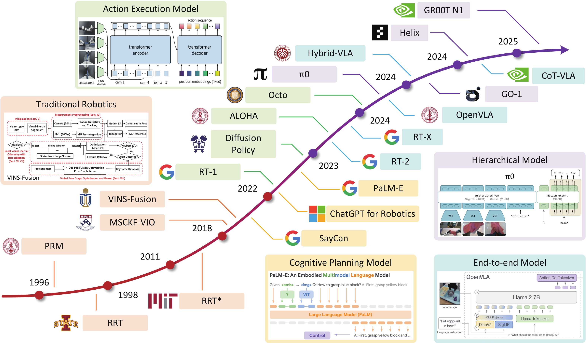

# \[15] VLA Overview

### 0. 배경 지식

#### 0.1 LLM · VLM · VLA 비교 테이블

<table><thead><tr><th width="117">구분</th><th width="199">LLM (Large Language Model)</th><th width="205">VLM (Vision-Language Model)</th><th>VLA (Vision-Language-Action Model)</th></tr></thead><tbody><tr><td>정의</td><td>언어를 이해하고 생성하는 모델</td><td>보고(vision) + 언어를 이해하는 모델</td><td>보고 + 이해하고 실제로 행동하는 로봇 모델</td></tr><tr><td>주요 입력</td><td>텍스트</td><td>이미지, 비디오, 텍스트</td><td>이미지, 비디오, 텍스트, 로봇 상태</td></tr><tr><td>주요 출력</td><td>텍스트</td><td>텍스트, 캡션, 임베딩</td><td>로봇 액션, 제어 명령, 궤적</td></tr><tr><td>다루는 세계</td><td>언어 세계</td><td>시각적 세계</td><td>물리 세계</td></tr><tr><td>물리적 행동</td><td>불가능</td><td>불가능</td><td>가능 (액추에이터 제어)</td></tr><tr><td>핵심 토큰</td><td>텍스트 토큰</td><td>텍스트 + 비전 토큰</td><td>텍스트 + 비전 + 액션 토큰</td></tr><tr><td>대표 예시</td><td>GPT, Claude, LLaMA</td><td>CLIP, BLIP, Flamingo, Gemini</td><td>RT-2, OpenVLA, Octo, GR00T</td></tr><tr><td>주 활용 분야</td><td>챗봇, 문서 생성, 코딩</td><td>이미지 이해, 로봇 인식</td><td>로봇 조작, 내비게이션, 제어</td></tr></tbody></table>

#### 0.2 로봇 정책(Policy)이란?

로봇 공학에서 정책(Policy)은 주어진 환경의 현재 상태(State)를 기반으로 목표를 달성하기 위해 로봇이 취해야 할 행동(Action)을 결정하는 일련의 규칙을 의미합니다. 주요하게 두 가지 유형이 있습니다.

* **결정론적(Deterministic):** 각 상태에 대해 특정 행동을 매핑합니다.
* **확률론적(Stochastic):** 각 상태에 대해 가능한 모든 행동의 확률 분포를 제공합니다.

로봇은 최종 목표 달성 여부에 따라 단일 에피소드 또는 여러 에피소드를 거칠 수 있습니다. 에피소드(Episode)는 초기 상태에서 종료 상태까지 로봇 에이전트와 주변 환경 간의 일련의 상호작용 과정을 의미하며, 다음과 같은 단계들을 포함합니다.

* 상태 (State, _s_)
* 행동 (Action, _a_)
* 보상 (Reward, _r_)
* 다음 상태 (Next State, _s'_)

이러한 에이전트들은 보통 시작점과 끝점이 주어졌을 때, 에피소드 내에서 시간 경과에 따른 누적 보상을 최대화하는 **강화학습** 방법으로 훈련됩니다. 이를 통해 모델은 시행착오(Trial and Error)를 거쳐 최적의 행동을 학습합니다. 또한, 이러한 로봇 정책은 관찰(observation)과 행동(action) 쌍의 궤적(trajectory)이 주어졌을 때 올바른 행동을 예측하도록 모델을 훈련시키는 **행동 복제(Behavioral Cloning)** 또는 모방 학습(Imitation Learning)을 수행하기도 합니다.

전통적으로는 각 하위 수준 작업(low-level tasks)이나 특정 로봇 하드웨어 구성에 맞춰 개별 정책이나 복잡한 휴리스틱을 생성했습니다. 하지만 현실 세계의 데이터는 복잡하고, 수많은 정책을 훈련시키는 것은 비용과 시간이 많이 소요되며 방대한 데이터가 필요합니다.&#x20;

만약 LLM을 활용하여 동적인 시나리오 전반에 걸쳐 일반화할 수 있는 시스템을 만들 수 있다면 어떨까요? 이는 로봇이 주변을 보고, 말하거나 쓰인 지시를 이해하며, 일반화 능력을 발휘해 실제 작업을 독립적으로 수행할 수 있음을 의미합니다.

#### 0.3 일반 목적 로봇 정책 (Generalist Robot Policies, GRP)

로봇 공학에서 일반 목적 정책(Generalist Policy)은 작업별 미세 조정(fine-tuning) 없이도 여러 다운스트림 작업을 해결하거나 새로운 작업에 적응할 수 있는 단일 통합 모델을 의미합니다. 여러 하위 작업이나 특정 플랫폼/하드웨어를 위해 훈련되어야 했던 전통적인 정책과 달리, 일반 목적 정책은 이름에서 알 수 있듯이 보지 못한 작업, 새로운 시나리오, 심지어 다양한 하드웨어 설정 전반에 걸쳐 일반화할 수 있는 창발적 행동(Emergent Behaviors)을 발현합니다.

대표적인 예로 **RT-2**, **π0 (Pi-Zero)**, **Isaac GR00T N1** 등이 있습니다. 이러한 GRP는 미리 프로그래밍되거나 하드 코딩된 지침에 얽매이지 않고, "관찰하고 이해하며 행동하는(Observe, Understand and Action)" 본성을 통해 중간 목표를 설정하며 과제나 문제를 스스로 탐색하고 해결해 나갑니다.

#### 0.4 왜 VLA가 필요한가?

LLM은 텍스트 기반 작업에서는 훌륭한 성능을 보이지만, 로봇이 작동하는 물리적 환경의 제약 조건을 이해하는 데에는 한계가 있습니다. 또한 텍스트만으로는 최종 목표를 완전히 설명할 수 없고, LLM이 섬세한 하위 수준의 행동을 항상 묘사할 수 없기 때문에 실행 불가능한 하위 목표를 생성하기도 합니다. 반면 이미지나 비디오는 세밀한(fine-grained) 정책과 행동을 생성할 수 있습니다.

> **"사진 한 장은 천 마디 말보다 낫다** \
> **(An image is worth 1000 words)" – Fred R. Barnard**

비전 언어 모델(VLM)은 대규모 이미지 및 비디오 멀티모달 데이터셋으로 훈련되었기 때문에 뛰어난 일반화 능력을 가집니다. 하지만 효과적인 로봇 제어와 조작을 위해서는 VLM 표현만으로는 충분하지 않으며, **액션 데이터**가 중요합니다. **VLA**는 VLM에 추가적인 **액션** 및 **관찰 상태** 토큰을 확장한 개념입니다.

* **상태(State):** 단일 토큰으로, 센서 값, 그리퍼 위치 및 각도 등 로봇의 관찰 정보를 나타냅니다.
* **행동(Action):** 정밀한 제어를 통해 궤적을 따라 수행해야 할 모터 명령 시퀀스를 나타내는 토큰입니다.

VLA라는 용어는 **Google RT-2** 논문에서 처음 만들어졌으며, PaLI-X와 PaLM-E를 백본으로 사용하여 "픽셀에서 행동으로(Pixels to Actions)" 변환을 수행합니다.

### 1. 개요

VLA 모델(Vision-Language-Action Model)은 텍스트, 이미지·비디오, 시연(Demonstration) 등의 입력을 받아 로봇의 액션을 직접 생성하는 로봇 파운데이션 모델을 통칭하는 개념입니다.

즉, 로봇 내부에서 **인지** → 추론 **→ 행동 생성**을 하나의 모델 또는 하나의 통합 파이프라인으로 수행하는 생성형 인공지능 로봇 모델이라 볼 수 있습니다.

기존의 로봇 제어 시스템이 아래와 같이 개별 모듈로 나누어 설계했다면,

* 센서 처리
* 상태 추정
* 경로 계획
* 제어기 설계

VLA는 이 중 상당 부분을 대규모 신경망 기반 모델이 통합적으로 담당한다는 점에서 근본적인 차이를 가집니다.

<figure><figcaption></figcaption></figure>

<mark style="color:red;">**The general architecture of vision-language-action models**</mark> [<mark style="color:red;">**`출처`**</mark>](https://medium.com/@uu7470911/vision-language-action-models-for-embodied-ai-a-survey-overview-d26f11af282c)

* **Vision Encoder**: 카메라 이미지나 비디오를 **비전 토큰**으로 변환해 로봇이 처리할 수 있는 표현을 만든다.
* **Language Encoder**: 사람의 자연어 명령을 **언어 토큰**으로 변환해 의미를 표현한다.
* **Action Decoder**: 비전 토큰과 언어 토큰을 입력으로 받아 **액션 토큰**을 생성하고, 이를 실제 로봇 행동으로 변환한다.
* **World Model**: 액션 토큰이 환경에 적용되었을 때의 결과를 예측하는 **환경 토큰/상태 전이 모델** 역할을 한다.
* **Reasoning**: 현재 상태 토큰과 목표 토큰을 바탕으로 어떤 액션 토큰 시퀀스가 적절한지 판단한다.

### 2. VLA와 로봇 파운데이션 모델의 관계

VLA는 로봇 파운데이션 모델(Robot Foundation Model)의 **부분집합**에 해당합니다.

* **VLA:** 반드시 Vision, Language, Action이라는 세 가지 컴포넌트를 모두 포함해야 합니다.
* **로봇 파운데이션 모델:** '로봇에 활용되는 범용 사전학습 모델'이라는 조건만 만족하면 되므로 개념적으로 더 넓습니다.

#### 관련 용어 정리

1. **로보틱 트랜스포머 (Robotic Transformer)**
   * 2020년대 초반 일부 모델에서 사용되던 표현으로, 최근에는 로봇 파운데이션 모델과 거의 동의어로 사용됩니다.
2. **피지컬 AI (Physical AI)**
   * 가장 포괄적인 개념입니다.
   * 시연 데이터를 그대로 복사하는 Motion Retargeting, 특정 작업에 특화된 저일반화 AI까지도 포함합니다.

개념의 포함 관계는 다음과 같이 정리할 수 있습니다.

> **Physical AI ⊃ Robot Foundation Model ⊃ VLA**

### 3. 산업적 배경과 연구 주도 세력

현재 VLA 및 로봇 파운데이션 모델 연구는 구글 딥마인드와 엔비디아가 주도하고 있습니다. 대부분의 로봇 하드웨어 기업들은 이들이 제공하는 플랫폼을 활용해 시뮬레이션, 학습, 모델 개발을 진행하는 구조를 택하고 있습니다.

#### 플랫폼 중심 분업 구조

엔비디아와 구글 모두 로봇 제조사와 직접 경쟁하기보다는 **플랫폼 사업자**로 자리매김하는 전략을 취하고 있습니다.

* 시뮬레이션
* 학습 인프라
* 파운데이션 모델 제공

이로 인해 **하드웨어 제조**와 **모델·시뮬레이션 플랫폼 개발** 사이의 분업화가 빠르게 진행되고 있습니다.

<figure><figcaption></figcaption></figure>

<figure><figcaption></figcaption></figure>

### 4. 협력과 경쟁: MuJoCo, Newton, Warp

VLA 모델 개발은 각자 진행되고 있지만, 로봇 인공지능 분야는 **데이터 부족**과 **시뮬레이션 인프라 부족**이라는 구조적 한계를 공유하고 있습니다. 이로 인해 엔비디아와 구글은 경쟁 관계이면서도 기초 인프라 영역에서는 필수적인 협력을 이어가고 있습니다.

<figure><figcaption></figcaption></figure>

이미지 출처 : <a href="https://developer.nvidia.com/isaac/gr00t"><code>NVIDIA</code></a>

#### 4.1 차세대 물리 엔진: Newton

**Newton**은 엔비디아(NVIDIA), 구글 딥마인드(Google DeepMind), 디즈니 리서치(Disney Research)가 로봇 개발을 가속화하기 위해 공동 개발한 오픈소스 물리 엔진입니다.

* **압도적인 성능:** GPU 가속 시뮬레이션과 미분 가능한 물리(Differentiable Physics) 기술을 결합하여, 기존 솔루션 대비 **약 70배 빠른 로봇 학습 속도**를 제공합니다. 이를 통해 객체 조작이나 동적인 움직임과 같은 복잡한 작업을 전례 없는 정밀도로 마스터할 수 있게 합니다.
* **핵심 기술 혁신:**
  * **NVIDIA Warp 기반 가속:** Warp 프레임워크를 통해 접촉 역학(Contact Dynamics)을 가속화합니다.
  * **Differentiable physics :** Gradient-based Policy Optimization를 지원하여 학습 효율을 극대화합니다.
  * **다중 물리 커플링:** 고체뿐만 아니라 유체, 직물(Fabric) 등 다양한 물성 간의 상호작용을 통합적으로 시뮬레이션합니다.
  * **호환성:** MuJoCo 및 Isaac Lab과 호환되며, OpenUSD 통합을 통해 표준화된 워크플로우를 보장합니다.
* **디즈니의 활용 (Next-Gen Robotics):** 디즈니는 Newton을 BDX 드로이드와 같은 차세대 로봇에 적용하여, 테마파크 내에서 사람과 안전하게 공존하고 표현력 있는 캐릭터 움직임을 구현할 계획입니다.

#### 4.2 MuJoCo Warp

* **GTC 2025 공개:** 기존의 CPU 기반 MuJoCo 엔진을 NVIDIA GPU에 최적화하여 대규모 병렬 시뮬레이션이 가능해졌습니다.

이러한 협력은 로봇 AI 학습 인프라가 아직 성숙 단계에 도달하지 못했음을 보여주는 동시에, 로봇 파운데이션 모델의 발전을 위해 시뮬레이션 기술의 혁신이 필수적임을 시사합니다.

### 5. 주요 개념 정리

#### 5.1 Sim2Real (Sim-to-Real Transfer)

시뮬레이션 환경에서 학습한 정책이나 모델을 실제 로봇에 적용하는 것을 의미합니다. 핵심 과제는 **Reality Gap**을 극복하는 것입니다. Sim2Real은 특히 강화학습 맥락에서 자주 언급되며, 이를 얼마나 잘 달성하느냐가 향후 인공지능 로봇 상용화의 성패를 가를 가능성이 높습니다.

#### 5.2 Generalization

학습 데이터에 포함되지 않았던 아래 상황들에 대해서도 로봇이 성공적으로 작업을 수행하는 능력을 의미합니다. 진정한 범용 로봇 지능을 위해 필수적인 요소입니다.

* 새로운 환경
* 새로운 객체
* 새로운 명령

#### 5.3 Multi-modal Learning

텍스트, 이미지, 비디오, 오디오, 촉각, 관절 상태 등 여러 데이터 양식을 동시에 입력받아 통합적으로 학습하는 방식입니다. VLA 모델은 본질적으로 멀티모달 학습이 불가능하면 성립할 수 없습니다.

<figure><figcaption></figcaption></figure>



#### 5.4 Cross-embodiment

지능이 특정 로봇 하드웨어에 종속되지 않고 **다른 로봇으로 전이될 수 있는 특성**을 의미합니다. `Open X-Embodiment`와 같은 데이터셋은 이 개념을 전제로 설계되었습니다.

#### 5.5 Action Token

로봇의 행동을 추상화·이산화한 단위로, 언어 모델의 토큰과 유사한 역할을 수행합니다. 다만 LLM의 _function callin&#x67;_&#xACFC;는 명확히 구분되며, 실제 물리 세계에서의 상호작용을 전제로 합니다.

### 7. 목적과 활용

#### 7.1 Control

* **Manipulation** (조작)
* **Locomotion** (이동)
* **Task Planning** (작업 계획)

초기에는 고정 베이스 조작에 국한되었으나, 최근에는 mobile manipulation, loco-manipulation까지 확장되고 있습니다.

#### 7.2 접근 방식 분류

| 구분                   | 설명                    | 대표 모델                          |
| -------------------- | --------------------- | ------------------------------ |
| **Modular Approach** | VLM·LLM 중심 서브모듈 결합 방식 | CLIPort, SayCan, PaLM-E        |
| **End-to-End VLA**   | 입력부터 액션까지 단일 정책으로 처리  | RT-1, RT-2, OpenVLA, Octo, GR1 |

### 8. 대표 모델 및 플랫폼

[참고 자료 : learn\_opencv](https://learnopencv.com/vision-language-action-models-lerobot-policy/)

<figure><figcaption></figcaption></figure>

<mark style="color:red;">**The evolution timeline of robotics and embodied AI :**</mark> [<mark style="color:red;">**`출처`**</mark>](https://www.jos.ac.cn/en/article/doi/10.1088/1674-4926/25020034?viewType=HTML)

#### 8.1 π₀ / π₀.₅ (Physical Intelligence)

* **개요:** 2024년 등장한 모델로, VLM 기반 **플로우 매칭(Flow Matching)** 아키텍처를 채택한 최초의 VLA입니다.
* **영향:** 후술할 엔비디아 GR00T N1 모델 개발에도 상당한 영향을 주었습니다.
* **현황:** 2025년에는 성능이 개선된 후속 모델 **π₀.₅**가 출시된 상태입니다.

#### 8.2 Gemini Robotics (Google DeepMind)

* **개요:** 구글 딥마인드의 RT-X, OpenVLA 등을 계승하며, **Gemini**의 강력한 멀티모달 추론 능력과 결합하여 성능을 대폭 향상시킨 모델입니다.
* **에코시스템:**
  * **Trusted Tester:** Agile Robots, Agility Robotics, Boston Dynamics, Enchanted Tools가 얼리 액세스를 확보했습니다.
  * **핵심 협력사:** **Apptronik**이 유일한 공식 협력사로서 여타 기업들보다 광범위한 협력 체제를 구축하고 있습니다.

#### 8.3 Isaac GR00T (NVIDIA)

2025년 3월 18일 발표된 엔비디아의 로봇 AI 풀스택 솔루션입니다. 'Project GR00T'의 일환으로, 인간의 행동을 관찰하고 자연어 명령을 이해하여 움직임을 모방·학습하는 로봇 플랫폼 개발을 목표로 합니다.

* **구성 요소:**
  * **Foundation Model:** Isaac GR00T N1
  * **Simulation:** NVIDIA Omniverse
  * **Data Pipeline:** Cosmos (합성 데이터 생성)
  * **Computer:** Jetson Thor (휴머노이드 전용)
* **생태계:**
  * **주요 협력사:** Figure AI, Unitree Robotics, Apptronik, Sanctuary AI, 1X Technologies, Fourier Intelligence, XPENG Robotics 등.
  * **N1 얼리 액세스:** Agility Robotics, Boston Dynamics, Mentee Robotics, NEURA Robotics.

<figure><figcaption></figcaption></figure>

이미지 출처 : <a href="https://developer.nvidia.com/isaac/gr00t"><code>NVIDIA</code></a>

#### 8.4 기타 주요 모델 및 스타트업

* **Figure AI:** OpenAI와의 협력을 통해 상당한 수준의 멀티모달 협력(Multi-modal collaboration) 능력을 시연했습니다. **Whole Upper Body Control**을 지원합니다.
* **1X Technologies:** 독자적인 VLA 모델을 통해 **Whole Body Control**을 구현하는 것으로 알려져 있습니다.
* **Generalist AI:** 구글 딥마인드 수석과학자 출신 피트 플로렌스(Pete Florence)가 창업한 기업의 모델로, **100Hz**의 높은 제어 주파수(Control Frequency)를 바탕으로 민첩한 테이블탑 조작 능력을 보여줍니다.

### 9. 학습, 시뮬레이터, 월드 모델

VLA 모델의 성능은 데이터의 양과 질, 그리고 이를 학습할 수 있는 환경(시뮬레이터)에 크게 의존합니다.

#### 9.1 데이터셋 (Dataset)

인공지능 로봇, 특히 실제 환경과 상호작용하며 범용적인 능력을 학습해야 하는 로봇 파운데이션 모델의 개발에 있어 양질의 대규모 데이터셋은 필수적입니다. 인터넷에서 쉽게 구할 수 있는 비전, 자연어 데이터와 달리 **액션 데이터**는 구축 비용이 매우 높고 대규모 확보가 어렵다는 특징이 있습니다.

현재는 체화 특정성(embodiment specificity)이 낮은 시뮬레이션 합성 데이터나 웹상의 영상 데이터를 병행하여 학습하는 추세입니다.

**주요 대규모 데이터셋 프로젝트**

* **Robomimic:** 스탠퍼드 대학교(SVL) 주도로 개발된 로봇 모방 학습 벤치마크 프레임워크입니다. 사람의 원격 조종(Teleoperation) 데이터 등 다양한 품질의 시연 데이터를 제공하여 알고리즘 성능을 공정하게 비교할 수 있게 합니다.
* **Open X-Embodiment:** 구글 딥마인드와 스탠퍼드 등 30여 개 기관이 협력한 초대형 프로젝트입니다. 22종의 서로 다른 로봇(Cross-embodiment) 데이터를 통합하여 일반화 성능을 극대화하는 것을 목표로 하며, **RT-X**와 **Octo**의 학습에 사용되었습니다.
* **Bridge Data:** UC 버클리와 구글이 주도한 데이터셋으로, 저비용 로봇 팔을 이용해 수집된 일상 사물 조작(Manipulation) 데이터가 주를 이룹니다.
* **DROID (Distributed Robot Interaction Dataset):** 2024년 뉴욕 대학교(NYU) 주도로 공개되었습니다. 전 세계 자원자들이 스마트폰과 로봇 팔(WidowX)을 이용해 분산 수집한 데이터로, 저비용으로 대규모 데이터를 구축할 수 있는 가능성을 보여주었습니다.

#### 9.2 시뮬레이터

물리 인공지능 학습을 위해 다양한 가상 환경이 활용됩니다. 특히 2025년에는 구글, 엔비디아, 디즈니 리서치가 공동 개발한 로보틱스 전용 물리엔진 뉴턴(Newton)이 발표되어 기존 물리 엔진(PhysX 등)을 대체할 예정입니다.

**주요 시뮬레이션 플랫폼**

* **Isaac Sim / Isaac Lab:** 엔비디아의 시뮬레이션 플랫폼으로, 모방학습과 강화학습을 모두 지원하며 고성능 GPU 가속을 활용합니다.
* **MuJoCo (Multi-Joint dynamics with Contact):** 구글 딥마인드가 관리하는 고성능 물리 엔진입니다. 정밀한 물리 연산이 강점입니다.
* **OpenAI Gym (Gymnasium):** 강화학습 연구의 입문과도 같은 환경으로, 간단한 제어부터 로봇 시뮬레이션까지 다양한 환경을 제공합니다.
* **Project Malmo / CraftGround:** 마인크래프트 기반의 복잡한 3D 환경 학습 플랫폼입니다.
* **기타:** DeepMind Lab, Unity ML-Agents, VizDoom 등이 있습니다.

#### 9.3 월드 모델 (World Model)

기존의 물리 시뮬레이터(Isaac Sim, MuJoCo 등)는 강체 역학(Rigid body dynamics) 시뮬레이션에 최적화되어 있어, 현실 세계의 복잡한 물리 법칙과 상호작용을 완벽히 모사하기 어렵다는 한계가 있습니다.

이를 극복하기 위해 **인공 신경망 기반의 월드 모델**이 도입되고 있습니다.

* **NVIDIA Cosmos:** 엔비디아가 주도하는 로봇 학습용 월드 모델입니다.
* **기업별 독자 개발:** 1x 등 일부 로봇 플랫폼 기업은 자사 하드웨어에 최적화된 월드 모델을 자체 개발하기도 합니다.

#### 9.4 학습 알고리즘 (Learning Algorithms)

**9.4.1 강화학습 (Reinforcement Learning, RL)**

로봇이 시행착오를 통해 최적의 행동 정책(Policy)을 스스로 찾아가는 방식입니다. 행동에 대한 보상(Reward)과 벌칙(Penalty)을 통해 학습합니다.

* **장점:** 미리 프로그래밍되지 않은 상황에서도 적응 가능하며, 데이터가 없는 상태에서도 시뮬레이션을 통해 학습할 수 있습니다.
* **한계:** 동작이 다소 어색하거나 끊길 수 있으며(Sim-to-Real Gap), 초기 학습 비용이 높습니다.

**9.4.2 모방학습 (Imitation Learning, IL)**

전문가(사람)의 시연(Demonstration) 데이터를 로봇이 그대로 흉내 내도록 학습하는 방식입니다. 모방학습은 가이드라인을 제시하는 강화학습의 지도학습 버전이라고 할 수 있는 **VLA 학습의 핵심**입니다.

* **행동 복제 (Behavior Cloning, BC):** 전문가의 '상태-행동' 쌍을 지도 학습(Supervised Learning) 방식으로 학습합니다.
* **장점:** 사람처럼 유려하고 자연스러운 동작을 구현할 수 있습니다.
* **한계:** 양질의 시연 데이터를 대규모로 확보하는 것이 어렵습니다.

### 마무리

VLA는 아직 완성된 기술이 아니라 **데이터, 시뮬레이션, 학습 알고리즘** 모두가 동시에 진화 중인 영역입니다.

이후 챕터에서 **MuJoCo + YOLO + LLM** 조합을 통해 VLA를 흉내내는 실험적 구조를 단계적으로 구현하며, 이론과 실제 사이의 간극을 직접 체험해 봅니다.
