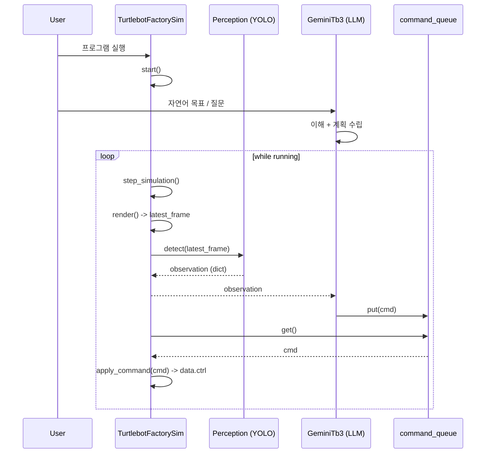

# \[20] MuJoCo: VLA 실습

앞선 챕터에서 YOLO를 이용한 객체 인식과 그 결과를 코드로 다루는 방법까지 준비했다면, 이제는 **보고(See) → 이해하고(Understand) → 행동하는(Act)** 로봇을 직접 경험하는 단계입니다.

### 1. 실습 개요

이 실습의 목적은 복잡한 제어 성능이나 알고리즘의 최적화가 아닙니다. 대신 다음과 같은 근원적인 질문에 답하는 것이 핵심입니다.

* 로봇은 무엇을 보고 있는가?
* 그 정보는 언어 모델에게 어떻게 전달되는가?
* 자연어 명령은 어떻게 실제 행동으로 변환되는가?

즉, 이 실습은 **VLA 시스템이 하나의 루프로 실제로 동작함을 확인하는 과정**입니다.

#### 실습에서 구현하는 전체 흐름

1. **로봇 카메라 입력을 YOLO로 객체 인식**
2. **YOLO 인식 결과를 구조화된 형태로 정리**
3. **구조화된 인식 결과와 자연어 입력을 LLM에 전달**
4. **LLM이 상황을 해석하고 행동(Action)을 생성**
5. **생성된 Action을 Turtlebot 시뮬레이션에 적용**

이 모든 과정은 끊김 없이 **실시간 루프**로 실행됩니다.

### 2. 전체 시스템 구조

<figure><figcaption></figcaption></figure>

#### 2.1 구성 모듈

VLA 실습 시스템은 다음 네 가지 핵심 모듈로 구성됩니다.

* **TurtlebotFactorySim**
  * MuJoCo 기반 터틀봇 시뮬레이션을 담당합니다.
  * 로봇 상태 업데이트와 저수준(Low-level) 제어를 수행합니다.
* **ObjectDetector (YOLO)**
  * 로봇 카메라 이미지에서 객체를 인식합니다.
  * 결과를 제어 및 추론에 적합한 구조(Dictionary/JSON)로 변환합니다.
* **GeminiTb3 (LLM)**
  * YOLO 인식 결과와 사용자 자연어 입력을 바탕으로 상황을 해석합니다.
  * 다음에 수행할 적절한 행동을 추론합니다.
* **command\_queue**
  * LLM이 생성한 행동을 시뮬레이션에 전달하는 인터페이스입니다.
  * 언어 모델(비동기/느림)과 제어 로직(실시간/빠름)을 분리하는 역할을 합니다.

#### 2.2 데이터 및 제어 흐름

전체 시스템의 데이터 흐름은 다음과 같습니다.



이 흐름을 단계별로 정리하면 다음과 같습니다.

1. **Input:** Turtlebot의 카메라 이미지가 입력으로 들어옵니다.
2. **Perception:** YOLO가 이미지에서 객체를 인식하고 결과를 구조화합니다.
3. **Prompting:** 구조화된 인식 결과와 자연어 질문이 LLM에 전달됩니다.
4. **Reasoning:** LLM은 현재 상황을 해석하고 적절한 행동(Action)을 생성합니다.
5. **Execution:** 생성된 Action은 `command_queue`를 통해 시뮬레이션에 적용됩니다.

#### 핵심 포인트

* **모듈화:** 인지(Perception), 언어(Language), 행동(Action)은 서로 분리된 모듈입니다.
* **통합 루프:** 실행 관점에서는 하나의 유기적인 루프로 동작합니다.
* **제어권 분리:** LLM은 로봇을 직접 제어하지 않고, **의사결정 결과만 생성**합니다. 실제 제어는 시뮬레이터가 담당합니다.

이러한 구조 덕분에 이후 단계에서 **탐색 로직, 안전 제어, 강화학습, 실제 로봇 제어**로의 확장이 용이합니다.

### 3. 프롬프트 설계

VLA 실습에서 프롬프트는 단순히 “말을 잘하게 만드는 문장”이 아닙니다. 이 시스템에서 프롬프트는 **로봇의 정체성, 판단 기준, 행동 규칙, 출력 인터페이스를 모두 정의하는 핵심 설계 요소**입니다.

본 실습에서는 아래와 같은 프롬프트 템플릿을 사용합니다. 이 프롬프트는 다음 세 가지를 명확하게 강제합니다.

1. **로봇이 스스로를 어떤 존재로 인식할지**
2. **어떤 정보를 우선적으로 신뢰할지**
3. **어떤 형식으로 행동을 출력해야 하는지**

#### 3.1 역할(Role) 정의

프롬프트의 가장 첫 줄은 모델의 정체성을 고정합니다.

> "당신은 거북이 로봇입니다. 사용자의 입력을 분석해 '주행 명령'과 '일상 대화'를 구분할 수 있습니다."

이 역할 정의를 통해 LLM은 일반적인 챗봇이 아니라 **MuJoCo 시뮬레이션 안에서 이동 가능한 주행 로봇**으로 행동하게 됩니다. 이 설정은 응답의 일관성과 현실감을 크게 높여주며, 모델은 이후 모든 질문을 “로봇이라면 어떻게 반응해야 하는가”라는 관점에서 해석하게 됩니다.

#### 3.2 출력 포맷 강제 (Action + Response)

이 프롬프트의 가장 중요한 특징 중 하나는 **출력 포맷을 강하게 제한**한다는 점입니다. 모든 응답은 반드시 다음 두 줄을 포함해야 합니다.

```
Action: …
Response: …
```

* **Action:** 시스템이 파싱하여 실제 로봇 제어에 사용하는 신호
* **Response:** 사용자에게 보여지는 자연어 응답

이를 통해 **로봇 제어 로직**과 **사용자 인터페이스**를 명확히 분리할 수 있습니다. 특히 “항상 예시 형식을 지켜서 출력하세요”라는 규칙을 반복적으로 강조함으로써, LLM이 포맷을 깨뜨리는 상황을 최대한 방지합니다.

#### 3.3 Observation 우선 원칙

VLA 시스템에서 가장 위험한 오작동은 언어 모델이 **상상이나 대화 맥락을 실제 환경보다 우선**하는 경우입니다. 이를 방지하기 위해 프롬프트는 다음 규칙을 명시합니다.

> "Observation(객체 인식 정보)이 제공되면, 반드시 그 정보를 최우선적으로 참고하여 답변하세요."

즉, **YOLO 객체 인식 결과는 현재 환경의 사실 정보**이며, LLM은 이 정보를 기준으로 판단해야 합니다. 이 원칙을 통해 “보이지 않는 것을 본 것처럼 말하거나 움직이는 문제(Hallucination)”를 구조적으로 억제합니다.

#### 3.4 객체 인식 정보 해석 규칙

프롬프트는 YOLO가 제공하는 정보의 형태와 의미를 명확히 설명합니다.

* **인식 대상:** `spade`, `heart`, `diamond`, `club` 네 가지 카드
* **의미 연결:** YOLO 영문 레이블을 한국어 의미(스페이드, 하트 등)와 연결
* **공간 추론:** `bbox`와 `center` 정보를 통해 객체의 위치(왼쪽/중앙/오른쪽) 추론

이 설명 덕분에 LLM은 YOLO 결과를 단순한 텍스트가 아니라 **공간 정보를 포함한 환경 상태**로 이해하게 됩니다.

#### 3.5 주행 명령 해석 규칙

자연어는 항상 모호할 수 있기 때문에, 프롬프트는 주행 명령 해석 규칙을 매우 구체적으로 정의합니다.

* “오른쪽으로 가”, “오른쪽으로 돌아봐” → **우회전** 또는 **제자리 회전**
* “앞으로 가”, “가까이 가줘” → **직진**
* “뒤로 와”, “뒤로 가줘” → **후진**

그리고 가장 중요한 규칙은 다음과 같습니다.

> "주행 명령이 여러 개 섞여 있어도, **한 번에 실행할 Action은 항상 정확히 하나만 선택**하세요."

이를 통해 로봇이 한 번에 여러 행동을 하려다 불안정해지는 상황을 방지합니다.

#### 3.6 일상 대화와 주행 명령의 분리

프롬프트는 대화와 행동을 명확히 분리합니다.

* **명확한 주행 명령이 아닐 경우:** `Action`은 항상 `멈춤(STOP)`
* **일상 대화:** `Response`만 자연스럽게 생성

이 규칙 덕분에 사용자가 감정적인 대화를 하거나 잡담을 하더라도 로봇이 의도치 않게 움직이지 않습니다.

#### 3.7 카드 탐색(Search) 행동 설계

이 프롬프트는 단순 이동뿐 아니라 **카드 탐색 행동**도 정의합니다. 특정 카드를 “찾아봐”, “보여줘”라고 요청했지만 **Observation에 해당 카드가 없을 경우**, `Action`은 반드시 **제자리 회전**이 되어야 합니다.

더 나아가 `SEARCH_HEART`, `SEARCH_DIAMOND` 등의 **의미 있는 탐색 Action**을 사용하도록 설계되어 있습니다. 이는 LLM이 모든 행동을 직접 제어하는 것이 아니라, **상태 기반 제어 로직과 협력**하도록 만든 설계입니다.

#### 3.8 Few-shot 예시의 역할

프롬프트 후반부에는 다수의 `[Question] – [Observation] – [Answer]` 예시가 포함되어 있습니다. 이 예시들은 단순 참고용이 아니라, 다음 요소들을 사실상 **학습 데이터**처럼 직접 제시하는 역할을 합니다.

* 상황 해석 방식
* Action 선택 기준
* Response의 톤과 길이
* 출력 포맷

이를 통해 LLM은 이 VLA 시스템에서 기대되는 “정답 스타일”을 빠르게 따라가게 됩니다.

#### 3.9 컨텍스트 변수 구조

프롬프트의 마지막에는 실제 실행 시 동적으로 채워지는 컨텍스트 구조가 정의됩니다.

```
[Previous Chat History]
{chat_history}

[Question]
{question}

[Observation]
{observation}

[Answer]
```

이 구조 덕분에 LLM은 **이전 대화 맥락**, **현재 사용자의 질문**, **현재 로봇이 보고 있는 환경**을 동시에 고려한 판단을 할 수 있습니다.

#### 정리

이 프롬프트는 단순한 텍스트가 아닙니다.

* 로봇의 정체성을 정의하고
* 환경 정보의 우선순위를 강제하며
* 행동 선택 규칙을 명확히 하고
* 시스템 친화적인 출력 인터페이스를 제공하는

**VLA 시스템의 핵심 제어 설계**입니다.

### 4. 실습 환경 준비

이 실습에서는 앞선 챕터에서 준비한 코드와 모델을 그대로 사용합니다. 환경 설정이나 설치 과정에 대한 설명은 최소화하고, **VLA 루프를 실제로 실행해보는 것**에 집중합니다.

#### 4.1 실행 파일 구성

실습에 사용되는 주요 파일은 다음 네 가지입니다.

* **tb3\_sim.py**
  * MuJoCo 기반 터틀봇 시뮬레이션 클래스입니다.
  * 로봇 제어, 카메라 렌더링, YOLO 추론 결과 처리까지 담당합니다.
* **gemini\_tb3.py**
  * Gemini LLM을 실행하는 에이전트입니다.
  * 프롬프트를 기반으로 자연어 입력과 객체 인식 정보를 해석하고 주행 Action을 생성합니다.
* **prompt.yaml**
  * VLA 시스템의 핵심 프롬프트 정의 파일입니다.
  * 로봇의 역할, 행동 규칙, 출력 포맷, 예시(Few-shot)를 모두 포함합니다.
* **best.pt**
  * YOLO 객체 인식 모델 가중치 파일입니다.
  * 카드(spade, heart, diamond, club) 인식을 위해 사용됩니다.

이 파일들이 모두 준비되어 있다는 것을 전제로 실습을 진행합니다.

#### 4.2 실행 스크립트

아래 코드는 VLA 실습을 실행하는 전체 스크립트입니다. 이전 챕터에서 사용한 코드와 동일하며, **시뮬레이션 + YOLO + LLM**을 하나의 루프로 연결합니다.

```
import os
from queue import Queue
from tb3_sim import TurtlebotFactorySim
from gemini_tb3 import GeminiTb3

# 1. 경로 설정
PROJECT_ROOT = os.path.abspath(os.path.join(os.getcwd(), ".."))
xml_path = os.path.join(PROJECT_ROOT, "asset", "robotis_tb3", "tb3_factory_cards.xml")
prompt_path = os.path.join(PROJECT_ROOT, "scripts", "prompt.yaml")
yolo_weights = os.path.join(PROJECT_ROOT, "scripts", "best.pt")

# 2. 명령 큐 생성 (비동기 통신용)
cmd_q = Queue()

# 3. 터틀봇 + YOLO 시뮬레이션 인스턴스 생성
sim = TurtlebotFactorySim(
    xml_path=xml_path,
    use_yolo=True,
    yolo_weight_path=yolo_weights,
    yolo_conf=0.4,
    command_queue=cmd_q,
    fps=60,
)

# 4. Gemini + YOLO + 명령 생성 에이전트 생성
agent = GeminiTb3(
    prompt_path=prompt_path,
    model="gemini-robotics-er-1.5-preview", # 사용 모델 지정
    command_queue=cmd_q,
)

# 5. LLM 쓰레드 시작 (사용자 입력 대기)
agent.start(sim)

# 6. 시뮬레이션 루프 시작 (키보드로 'q' 누르면 종료)
sim.start()
```

#### 실행 흐름 요약

이 스크립트는 다음 순서로 동작합니다.

1. **TurtlebotFactorySim 생성:** MuJoCo 시뮬레이션 로드, 로봇 카메라 활성화, YOLO 객체 인식 준비
2. **GeminiTb3 에이전트 생성:** `prompt.yaml` 로드, 자연어 입력과 객체 인식 결과를 기반으로 Action 생성 준비
3. **LLM 스레드 시작:** 사용자 입력을 비동기적으로 처리하기 위한 스레드 구동
4. **시뮬레이션 루프 실행:** `YOLO → LLM → Action → 로봇 제어`의 루프 반복
5. **종료:** `q` 키 입력 시 시뮬레이션 및 에이전트 종료

이제 모든 준비가 끝났으며, 다음 단계에서는 실제로 로봇과 대화하며 VLA 동작을 관찰하게 됩니다.

### 5. 실습 1: 인식 결과를 말로 설명하게 하기

이 첫 번째 실습에서는 **로봇이 보고 있는 환경을 언어로 설명할 수 있는지**를 확인합니다. 아직 복잡한 주행 제어가 목적이 아닙니다. **YOLO 객체 인식 결과가 LLM에 전달되고, 그 정보가 Response에 자연스럽게 반영되는지**를 관찰하는 것이 주된 목표입니다.

#### 5.1 실습 목표

이 실습의 목표는 다음과 같습니다.

* 로봇 카메라 → YOLO → Observation 전달 과정의 정상 동작 확인
* LLM이 Observation을 기반으로 상황을 적절히 설명하는지 확인
* 보이지 않는 객체를 상상해내는 환각(Hallucination) 현상 여부 점검

즉, “로봇이 실제로 보고 있는 것만 말하는가?”를 검증합니다.

#### 5.2 실습 방법

시뮬레이션을 실행한 상태에서 아래와 같은 질문을 입력해 봅니다.

* "앞에 뭐가 있어?"
* "지금 뭐가 보여?"
* "주위에 카드가 있어?"

이 질문들은 명확한 주행 명령이 아니기 때문에, **Action은 `멈춤` 상태가 유지되고, Response만 생성되는 것이 정상**입니다.

#### 5.3 기대 동작

정상적으로 동작한다면 다음과 같은 흐름이 나타납니다.

1. 로봇 카메라 화면에서 카드가 인식됩니다.
2. YOLO가 인식 결과를 `Observation` (JSON 형태)으로 생성합니다.
3. `Observation`이 프롬프트에 동적으로 삽입됩니다.
4. LLM은 해당 정보를 바탕으로 상황을 설명합니다.
5. `Action`은 '멈춤'으로 유지됩니다.

#### 5.4 실행 화면 예시

<figure><figcaption></figcaption></figure>

<figure><figcaption></figcaption></figure>

#### 5.5 예시 대화

다음은 실제 실습 중 발생할 수 있는 대화 로그의 예시입니다.

```
[Question]
앞에 뭐가 있어?

[Answer]
Action: 멈춤
Response: 주변에 아무것도 보이지 않아요.

[Question]
주위에 카드가 있어?

[Answer]
Action: 멈춤
Response: 네, 주위에 카드가 보여요. 하트, 다이아몬드, 클로버, 스페이드 카드가 있네요. 어떤 카드를 보고 싶나요?
```

이 예시에서 중요한 점은 다음과 같습니다.

* **Response**가 철저히 `Observation`에 기반해 생성되었습니다.
* 인식되지 않은 객체는 언급하지 않았습니다.
* 주행 명령이 아니므로 **Action**은 `멈춤`으로 설정되었습니다.

#### 5.6 관찰 포인트

이 실습에서 반드시 확인해야 할 검증 포인트는 다음과 같습니다.

* **카드가 없을 때:** "지금은 아무 카드도 보이지 않아요"와 같이 사실에 기반한 응답이 나오는지 확인합니다.
* **카드 위치 변경 시:** 카드의 위치가 바뀌면 Response의 내용(왼쪽, 오른쪽 등)도 함께 바뀌는지 확인합니다.
* **Observation이 비어 있을 때:** LLM이 상상으로 객체를 만들어내지 않는지 점검합니다.

이 단계에서 문제가 발생한다면, 이후 진행될 주행 실습에서도 오작동이 발생할 가능성이 매우 높습니다.

#### 5.7 이 실습의 의미

이 실습은 단순한 챗봇 테스트처럼 보일 수 있지만, VLA 시스템에서는 매우 중요한 의미를 가집니다.

* 언어 모델이 환경 정보(Perception)를 신뢰하는지
* 시각 정보가 추론(Reasoning)의 기준이 되는지
* 대화(Response)와 행동(Action)이 명확히 분리되어 있는지

위 세 가지를 동시에 검증하는 단계이기 때문입니다. 이 단계가 안정적으로 동작해야만, 다음 실습에서 진행할 **자연어 → 행동(Action)** 전환이 비로소 의미를 갖게 됩니다.

### 6. 실습 2: 자연어 → 행동 생성 (Search 모드 포함)

이 실습에서는 **자연어 입력이 실제 로봇 행동(Action)으로 변환되는 전체 흐름**을 확인합니다. 단순 이동 명령뿐 아니라, **목표가 보이지 않을 때 자동으로 탐색(Search) 모드로 전환되는 과정**까지 하나의 실습으로 다룹니다.

#### 6.1 Action 생성 흐름

자연어 명령이 입력되었을 때, 시스템 내부에서는 다음과 같은 단계가 순차적으로 실행됩니다.

1. **LLM 응답 생성:** 사용자 질문 + Observation(YOLO 결과)을 기반으로 LLM이 응답을 생성합니다.
2. **Action 라인 추출:** LLM 출력에서 `Action:`에 해당하는 한 줄만 파싱합니다.
3. **command\_queue에 Action 전달:** 추출된 Action은 Queue에 넣어지고, 시뮬레이션 루프에서 비동기적으로 처리됩니다.
4. **TurtlebotFactorySim이 Action 실행:** 제어 로직이 Action을 해석하여 로봇의 바퀴 속도 또는 상태를 갱신합니다.

> **📌 중요한 점:** LLM은 로봇을 직접 움직이지 않습니다. LLM은 **의사결정**만 담당하고, 실제 제어는 **시뮬레이션 로직**이 수행합니다.

#### 6.2 기본 주행 명령 예시

시뮬레이션 실행 후, 다음과 같은 질문을 입력해 봅니다.

* "하트 카드 쪽으로 가"
* "멈춰"
* "지금 보이는 게 없으면 돌아봐"

이 질문들에 대해 LLM은 Observation을 참고하여 정확히 하나의 Action을 선택합니다.

**예시:**

<figure><figcaption></figcaption></figure>

<figure><figcaption></figcaption></figure>

#### 6.3 목표가 보이지 않을 때: Search 모드 전환

이 실습의 핵심은 **목표 객체가 Observation에 없을 때의 동작**입니다. 예를 들어 다음과 같은 상황을 가정해 봅니다.

```
[Question]
하트 카드 찾아봐     
[Answer]
➡️ 'heart' 카드가 안 보여서 SEARCH_HEART로 탐색할게요.
[Actionc]💬 Human: [TurtlebotFactorySim] Start search for 'heart' (cmd=SEARCH_HEART)
[TurtlebotFactorySim] Found 'heart' → stop search.
```

이 경우 프롬프트 규칙에 따라 LLM은 다음과 같이 판단합니다.

1. 요청된 카드(heart)가 Observation에 없음
2. 즉시 해당 카드를 찾기 위한 **탐색 행동** 선택

이 Action은 `command_queue`를 통해 전달되며, 시뮬레이션은 **탐색(Search) 모드**로 전환됩니다.

#### 6.4 Search 모드에서의 로봇 동작

1. 로봇은 **제자리 회전**을 지속합니다.
2. 매 프레임 YOLO 객체 인식 결과를 확인합니다.
3. **목표 카드가 감지되면:**
   * 즉시 회전을 멈춥니다.
   * Search 모드를 종료합니다.

<figure><figcaption></figcaption></figure>

이 과정에서 LLM은 추가로 개입하지 않습니다. 탐색 중단 여부는 전적으로 인지(YOLO 감지)에 의해 결정됩니다.

#### 6.5 실습 중 관찰 포인트

이 실습에서 반드시 확인해야 할 사항은 다음과 같습니다.

* LLM이 항상 **하나의 Action**만 출력하는지
* 목표가 보일 때와 보이지 않을 때 **Action이 명확히 달라지는지**
* Search 모드 종료가 **YOLO 감지를 기준으로 자동 처리**되는지

이 단계가 안정적으로 동작하면, VLA 시스템의 기본 의사결정 루프는 완성된 것입니다.

### 7. 실습 3: 검색(Search) 모드의 의미

앞선 실습에서는 Search 모드를 직접 경험했다면, 이 섹션에서는 **왜 이런 구조를 사용하는지**를 정리합니다.

#### 7.1 상태 기반 제어 + 인지 이벤트 트리거

Search 모드는 단순한 회전 동작이 아닙니다.

* **상태 기반 제어:** "현재는 검색 중이다"라는 상태를 유지
* **인지 이벤트 트리거:** YOLO가 목표 객체를 감지하면 상태 전환

즉, 로봇은 매 순간 LLM의 지시를 기다리지 않습니다. 이는 VLA 시스템을 **반응형(Reactive)이면서도 안정적인 구조**로 만드는 핵심 설계입니다.

#### 7.2 LLM과 제어 로직의 분리

이 실습에서 가장 중요한 메시지는 다음과 같습니다.

> **"VLA 시스템에서 LLM은 의사결정을 담당하고, 제어 로직은 안정성을 담당합니다."**

* **LLM:** "무엇을 할지" 결정
* **제어 로직:** "어떻게 안전하게 수행할지" 담당

이 분리 덕분에 LLM 출력이 약간 흔들려도, 로봇이 갑자기 이상한 행동을 하지 않고 실시간 시뮬레이션이 안정적으로 유지될 수 있습니다.


