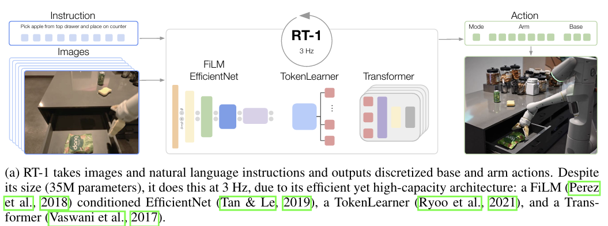
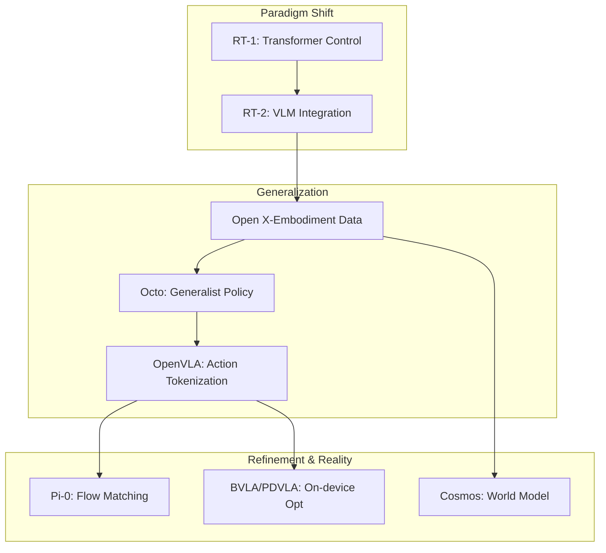

# \[21] VLA 오픈소스

### 0. Terminology: 핵심 용어 정의

이 문서에서 반복적으로 사용되는 핵심 기술 용어입니다.

* **VLM (Vision-Language Model):** 이미지(Vision)와 텍스트(Language)를 결합하여 시각 정보를 이해하고 추론하는 모델입니다. (예: GPT-4V, Gemini Vision)
* **VLA (Vision-Language-Action Model):** VLM에 **'행동(Action)'** 능력을 추가한 모델입니다. 시각과 언어를 입력받아 로봇의 제어 명령(Trajectory/Action Token)을 직접 출력합니다.
* **RT (Robotics Transformer):** Google DeepMind가 주도한 로봇 제어 모델 시리즈입니다.
  * **RT-1 (2022):** 트랜스포머 아키텍처를 로봇 제어에 도입했습니다.
  * **RT-2 (2023):** VLM의 추론 능력과 로봇 제어를 결합하여 본격적인 VLA 시대를 열었습니다.

### 1. Paradigm Shift (2022–2023): 로봇 제어의 전환점

#### 1.1 기존 로봇 제어 (Pre-VLA)

과거의 로봇 제어는 정교한 수식, 제어 이론, 상태 공간(State-Space) 모델을 중심으로 이루어졌습니다.

* **한계:** 로봇 하드웨어마다 전용 제어기가 필요했으며, "어떻게 움직일지"에 대한 모든 경로를 사람이 사전에 설계하거나 코딩해야 했습니다.

#### 1.2 전환점: RT-1 & RT-2의 등장

Google DeepMind는 언어 모델이 텍스트 토큰을 예측하듯, "로봇의 행동도 토큰(Token)으로 예측할 수 있다"는 혁신적인 아이디어를 제시했습니다.

> **핵심 아이디어:** 영상(Vision), 언어(Language), 로봇 관절 움직임(Action)을 모두 동일한 형태의 **데이터 토큰**으로 취급한다.

* **기술적 변화:**
  * **Semantic Control:** 좌표 `(x, y)` 이동 명령이 아닌, "서랍을 열고 콜라를 집어줘"와 같은 의미적 명령 수행이 가능해졌습니다.
  * **Robot Language:** 로봇 제어 신호가 일종의 언어 체계로 편입되었습니다.

#### RT-1

<figure><figcaption></figcaption></figure>

<figure><figcaption></figcaption></figure>

<figure><figcaption></figcaption></figure>

#### RT-2

<figure><figcaption></figcaption></figure>

<figure><figcaption></figcaption></figure>

### 2. Era of Generalization (2024): 데이터 스케일링과 범용 정책

2024년의 화두는 **"하나의 모델로 모든 로봇을 제어할 수 있는가?"** 였습니다. 개별 로봇마다 데이터를 따로 모으고 학습시키는 비효율을 극복하기 위한 시도들이 이어졌습니다.

#### 2.1 The Generalist Policy (범용 정책)

* **Open X-Embodiment:** 전 세계 다기관, 다종 로봇 데이터를 통합하여 거대 데이터셋을 구축했습니다.
* **Octo:** 수십 종의 로봇, 수백 개의 작업 데이터를 하나의 트랜스포머 모델로 학습하여, 서로 다른 하드웨어(Cross-embodiment)를 하나의 정책으로 제어할 수 있음을 증명했습니다.

**Open X-Embodiment**

<figure><figcaption></figcaption></figure>

<figure><figcaption></figcaption></figure>

#### 2.2 Action Tokenization의 정립 (OpenVLA)

* **OpenVLA:** 연속적인 로봇의 제어 신호를 언어 모델이 처리할 수 있는 이산적 토큰(Discrete Token)으로 변환하는 방식(Quantization)을 정립했습니다.
* **성과:** RT-2X와 같은 거대 모델보다 훨씬 작은 파라미터로 동급 이상의 성능을 달성하며, 오픈소스 생태계를 통해 VLA 연구를 가속화했습니다.

> 💡 **2024년의 결론:** "로봇 AI도 LLM처럼 파운데이션 모델(Foundation Model) 시대에 진입했다."

**OpenVLA**

<figure><figcaption></figcaption></figure>

<figure><figcaption></figcaption></figure>

<figure><figcaption></figcaption></figure>

<figure><figcaption></figcaption></figure>

<figure><figcaption></figcaption></figure>

### 3. Architecture Innovation (2025): 아키텍처의 진화

2025년의 연구 흐름은 단순히 모델 크기와 데이터를 늘리는 것을 넘어, "제어의 품질과 안정성"을 높이는 아키텍처 혁신으로 이동했습니다.

#### 3.1 Flow Matching 기반 제어 (Pi-Zero)

기존 VLA의 약점이었던 '이산적 토큰 생성으로 인한 끊김 현상'과 '정밀한 연속 제어' 문제를 해결하기 위해 등장했습니다. (Physical Intelligence 등 주도)

* **접근법:** 디퓨전(Diffusion) 모델의 생성 능력을 활용하되, 더 빠르고 효율적인 **플로우 매칭(Flow Matching)** 기법을 도입했습니다.
* **Pi-0 (Pi-Zero):** 텍스트/이미지 입력을 받아 연속적인 행동 궤적(Trajectory)을 생성합니다.
  * 기존 디퓨전 대비 추론 속도가 빠릅니다.
  * 결정론적(Deterministic) 특성으로 고주파 제어(High-frequency control)에 유리합니다.

#### 3.2 인지와 행동의 분리

모든 것을 하나의 거대 모델로 처리하는 비효율을 개선하기 위한 시도입니다. (예: CogAct)

* **High-Level :** 고차원 사고, 계획 수립, 언어 이해는 거대 LLM이 담당합니다.
* **Low-Level :** 실제 관절 제어와 즉각적인 반응은 작고 빠른 전용 컨트롤러가 담당합니다.
* **효과:** Long-horizon(장기 수행) 작업에서의 안정성이 급상승했습니다.

### 4. Big Tech Strategy: 인프라와 리즈닝

글로벌 빅테크 기업들은 VLA를 단순한 제어기가 아닌 "물리 세계를 이해하는 지능"으로 정의하고 있습니다.

#### 4.1 Google DeepMind (Gemini Robotics)

* **핵심 전략:** **Reasoning (추론)**
* **특징:** 단순히 물체를 인식하는 것을 넘어, "왜 이 행동을 해야 하는가?", "지금 이 행동이 왜 위험한가?"를 판단하는 추론 능력을 강조합니다.
* **정의:** 로봇 = 물리 세계와 연결된(Grounded) 거대 언어 모델.

#### 4.2 NVIDIA (Project GR00T & Cosmos)

* **핵심 전략:** **Simulation & World Model**
* **특징:**
  * **Cosmos (World Foundation Model):** 로봇이 행동하기 전에 물리적 결과를 미리 시뮬레이션(상상)해보고 최적의 행동을 결정합니다.
  * 물리 법칙을 이해하는 생성형 AI를 통해 학습 데이터 부족 문제를 해결합니다.

### 5. Optimization: "현실의 로봇에 어떻게 넣을 것인가?"

연구실의 슈퍼컴퓨터가 아닌, 배터리로 동작하는 로봇(Jetson, 임베디드 보드)에서 VLA를 구동하기 위한 **On-device AI** 최적화 기술들입니다.

#### 5.1 경량화: BVLA (Binary/Bit VLA)

* **개념:** 모델의 가중치를 극단적인 저비트(1bit \~ 1.5bit)로 양자화(Quantization)합니다.
* **효과:** 메모리 사용량과 연산량을 대폭 감소시켜, 엣지 디바이스에서도 거대 VLA 모델 구동 가능성을 입증했습니다.

#### 5.2 속도 개선: PDVLA (Parallel Decoding)

* **문제:** 기존 오토리그레시브(Auto-regressive) 방식은 한 번에 하나씩 토큰을 생성하여 속도가 느립니다.
* **해결:** **병렬 디코딩(Parallel Decoding)** 기법을 도입하여 여러 행동 토큰을 동시에 생성, 지연 시간(Latency)을 획기적으로 단축했습니다.

#### 5.3 실시간성: RTC (Real-Time Chunking)

* **문제:** 로봇이 생각(추론)하는 동안 멈칫거리거나, 이미 생성된 계획이 실시간 상황 변화와 맞지 않는 문제.
* **해결:** 실행 중인 행동 청크(Action Chunk)의 뒷부분을 실시간 센서 데이터에 맞춰 동적으로 보정합니다.

### 6. 대표 오픈소스 VLA 프로젝트 정리

VLA 연구가 활발해지면서 누구나 쉽게 실험하고 로봇에 적용할 수 있는 오픈소스 프로젝트들이 등장하고 있습니다.

#### 한눈에 보는 비교

| 이름                 | 기반 모델 / 구조                | 주요 특징                               | 공개 범위        |
| ------------------ | ------------------------- | ----------------------------------- | ------------ |
| **OpenVLA**        | LLaMA 2 + DINOv2 + SigLIP | Open X-Embodiment 기반 대규모 학습, 범용 VLA | 코드·체크포인트·노트북 |
| **VLA-0 (NVLabs)** | Qwen2.5-VL-3B             | LIBERO 벤치마크 재현 가능한 파이프라인            | 코드·학습/평가     |
| **SmolVLA**        | \~450M 파라미터               | 경량·로컬 실행 지향                         | 모델·코드        |
| **DreamVLA**       | 독자적 아키텍처                  | 다수 벤치마크 성능 보고 (NeurIPS 2025)        | 코드·체크포인트     |

#### 6.1 OpenVLA

* **모델 구성 (Architecture)**
  * **언어 백본:** LLaMA 2
  * **시각 인코더:** DINOv2 + SigLIP (Fused Visual Encoder)
  * **출력 방식:** 언어 토큰 + 행동(Action) 토큰을 하나의 시퀀스로 통합 처리
* **학습 데이터**
  * **소스:** Open X-Embodiment 데이터셋
  * **규모:** 약 97만 개 로봇 데모 에피소드 (다기관·다로봇·다태스크 통합)
* **주요 성과**
  * RT-2-X(55B) 대비 29개 로봇 조작 과제에서 평균 성공률 **+16.5%p** 향상
  * 파라미터 수는 약 7배 작음 (≈7B)
* **오픈소스 범위**
  * PyTorch 기반 학습 코드 (FSDP, FlashAttention 지원)
  * LoRA 및 풀 파인튜닝 지원
  * RLDS 포맷 데이터 믹스 예제, 체크포인트 및 실험 노트북 제공

#### 6.2 VLA-0 (NVLabs)

* **모델 구성 (Architecture)**
  * **기반 모델:** Qwen2.5-VL-3B 멀티모달 모델 (기존 VLM 구조 유지)
  * **출력 방식:** 행동을 텍스트 토큰(정수 시퀀스)으로 직접 표현하여 언어 토큰과 동일하게 생성
* **학습 데이터**
  * **소스:** 로봇 조작 데이터(LIBERO 등)로 구성된 중규모 로보틱스 데이터셋
  * **특징:** 대규모 Action-Pretraining 없이, 주어진 로봇 데이터만으로 학습
* **주요 성과**
  * LIBERO 벤치마크에서 기존 방법들(π0.5-KI, OpenVLA-OFT, SmolVLA 등)을 평균 성공률 기준 상회
  * 대규모 Action Pretraining을 사용한 모델들(π0, GR00T-N1 등)보다 높은 성공률 및 순위 달성
* **오픈소스 범위**
  * GitHub를 통한 학습 코드, 평가 스크립트, 사전 학습 모델 공개
  * LIBERO 중심의 표준화된 평가 파이프라인 및 설정 파일 제공
* **의의**
  * “행동을 별도 토큰 설계 없이 텍스트로 직접 표현해도 SOTA 수준이 가능하다”는 점을 실험적으로 증명
  * 단순 아키텍처로도 강력한 성능을 내며, 재현성 높은 벤치마크 레퍼런스로 기능

#### 6.3 SmolVLA

* **모델 구성 (Architecture)**
  * **규모:** 약 450M 파라미터 (초경량 모델)
  * **설계 목표:** 소비자용 GPU/CPU에서 동작 가능한 경량 구조, 실시간 제어 최적화
* **학습 데이터**
  * **소스:** Hugging Face LeRobot 커뮤니티의 공개 로봇 데이터셋(`lerobot` 태그) 활용
  * **특징:** 대규모 사설 데이터 없이 커뮤니티 오픈 데이터 기반 학습
* **주요 성과**
  * LIBERO, Meta-World, SO100/101 등 시뮬레이션·실세계 벤치마크에서 우수한 성능 보고
  * 대형 VLA 대비 약 1/10 수준의 학습량으로도 경쟁력 있는 성공률 달성
* **오픈소스 범위**
  * 모델 웨이트, 학습/추론 코드, 예제 스크립트 및 데모 전체 공개
  * 소비자용 GPU 수준에서 재현 가능한 학습 레시피 제공
* **의의**
  * “VLA는 수십 B 파라미터와 대규모 사설 데이터가 필요하다”는 통념에 대한 반례
  * 교육·연구·프로토타입용 베이스라인으로 활용하기 용이한 실용적 모델

#### 6.4 DreamVLA

* **모델 구성 (Architecture)**
  * **특징:** 독자적 아키텍처 채택
* **주요 성과**
  * **출처:** NeurIPS 2025 발표 논문
  * **성능:** 다수 로봇 조작 벤치마크에서 기존 VLA 및 로보틱스 정책 대비 성능 향상 보고
* **오픈소스 범위**
  * 학습 코드, 체크포인트, 실험 스크립트 제공 (장기 검증 진행 중)

#### 6.5 OpenVLA를 중심으로 본 VLA 구조

**구조 개요**

1. 입력 이미지 → DINOv2 + SigLIP로 시각 임베딩
2. 시각 토큰 + 언어 토큰을 LLaMA 2 입력 시퀀스로 결합
3. 출력 시퀀스에 행동(action) 토큰 포함
4. 행동 토큰을 로봇 제어 신호(관절/엔드이펙터)로 디코딩

```
graph TD
    Img[Image / Video] --> Enc[Visual Encoder (DINOv2 + SigLIP)]
    Enc --> LLM[LLaMA 2 (Language + Action Tokens)]
    LLM --> Act[Action / Trajectory Sequence]
```

#### 6.6 오픈소스 생태계 & 서빙(Serving)

**학습/파인튜닝**

* **대규모 분산 학습:** PyTorch FSDP
* **효율적 어텐션:** FlashAttention
* **적은 데이터로 적응:** LoRA
* **로봇 로그 표준:** RLDS 포맷

**서빙 & 실전 활용 (sglang-vla)**

* **개요:** OpenVLA / Prismatic 계열 모델 서빙 엔진
* **목표:** 낮은 지연(latency), 높은 처리량(throughput), REST API 제공
* **의미:** VLA를 “연구용 코드”가 아니라 **실제 로봇 시스템의 한 컴포넌트**로 쓰는 시나리오 제시

VLA는 더 이상 단일 논문 아이디어가 아니라, **대규모 데이터(Open X-Embodiment)**, **공개 구현(OpenVLA, VLA-0 등)**, 서빙 인프라(sglang-vla)가 함께 움직이는 오픈 생태계 단계에 진입했습니다. 특히 **OpenVLA**는 구조, 데이터, 성능, 코드가 모두 공개된 **사실상의 레퍼런스 VLA 구현체** 역할을 하고 있습니다.

### 7. SmolVLA란

SmolVLA는 VLA 로봇 정책 모델을 다음 목표로 재설계한 오픈소스 프로젝트입니다. 기존의 대형 VLA(수십억 파라미터)가 가진 고가 장비 의존성, 높은 지연 문제를 해결하기 위해 등장했습니다.

* 규모: 약 4.5억(450M) 파라미터 (초경량)
* 목표: 소비자용 하드웨어 실행, 저렴한 학습 자원, 커뮤니티 데이터 기반 훈련

#### 🧠 핵심 설계 철학

> "대형 모델 없이도 실용 수준의 VLA가 가능할까?"

* 경량·고효율: 일반 소비자용 GPU(RTX 30/40 시리즈)나 노트북에서도 실행 가능한 수준을 지향합니다.
* 접근성: 고가의 데이터센터급 GPU 없이도 누구나 VLA를 학습하고 실험할 수 있도록 진입 장벽을 낮췄습니다.

#### 7.1 모델 아키텍처: 6가지 핵심 구성 요소

<figure><figcaption></figcaption></figure>

SmolVLA는 효율성을 극대화하기 위해 다음과 같은 아키텍처를 채택했습니다.

1. SmolVLM 기반 백본: Vision + Language + State 입력을 통합 처리하며, 시각 정보를 압축하여 처리 효율을 높였습니다.
2. 프로젝터 (Projectors): 이미지, 로봇 상태(State), 과거 행동 등 서로 다른 형식의 입력을 VLM이 이해할 수 있는 공통 벡터 공간으로 정규화합니다.
3. 시각 토큰 축소 (Visual Tokens Reduction): 공간 풀링 등을 통해 이미지 토큰을 약 64개 수준으로 대폭 축소하여 연산량을 줄였습니다.
4. 레이어 스킵 (Layer Skipping): Vision 인코더(SigLIP 등)의 후반부 고차원 추상 레이어를 건너뛰어 시각 인코딩 속도를 2배 이상 높였습니다. (로봇 조작에는 위치/형태 정보가 더 중요하기 때문)
5. Flow Matching Action Expert: 노이즈에서 정답 행동 경로를 부드럽게 생성하는 Flow Matching 기법을 적용하여 연속적인 행동(Trajectory)을 효율적으로 예측합니다.
6. 인터리브 어텐션 (Interleaved Attention): Action Expert 내부에서 Cross-Attention(상황 파악)과 Causal Self-Attention(행동 일관성 유지)을 번갈아 수행하여 의미 이해와 제어 품질을 동시에 확보했습니다.

#### 🔄 비동기 추론 (Asynchronous Inference)

<figure><figcaption></figcaption></figure>

전통적인 `관측 → 추론 → 행동`의 순차적 방식은 로봇이 추론하는 동안 멈추는(Freezing) 문제가 있었습니다. SmolVLA는 행동 실행과 추론을 병렬로 처리하여, 로봇이 동작하는 동안 백그라운드에서 다음 행동을 예측합니다.

* 효과: 평균 응답 속도 30% 향상, 작업 처리량 최대 2배 증가

#### 📊 데이터 전략: 커뮤니티 기반

<figure><figcaption></figcaption></figure>

대형 기업의 독점 데이터 대신, LeRobot 등 오픈 커뮤니티에서 수집된 공개 데이터를 활용합니다.

* 규모: 약 22.9K 에피소드, 1,060만 프레임 수준
* 정제: VLM을 활용해 자동 라벨링을 수행하고, 카메라 시점을 정규화하여 데이터 품질을 높였습니다.

#### 7.2 **알고리즘 작동 원리 (Algorithm 1)**

<figure><figcaption></figcaption></figure>

**전체 개념:** 로봇 제어를 동영상 스트리밍의 버퍼링처럼 처리하는 **비동기 액션 생성 방식**

* **Action Queue:** 로봇이 실행할 미래 행동(Action Chunk)을 순서대로 저장하는 버퍼
* **PopFront:** 큐 맨 앞의 액션을 하나씩 꺼내 실제 로봇에 실행
* **임계값 트리거 (**$g$**):** 큐에 남은 액션 비율이 $g$ 미만이 되면 다음 액션 청크 추론을 요청
* **Non-blocking Inference:** 새 청크를 계산하는 동안 로봇은 기존 큐를 계속 실행 (멈춤 없음)
* **Aggregation:** 새로 계산된 액션 청크를 기존 큐의 잔여 액션 뒤에 부드럽게 연결
* **Fallback:** 추론이 아직 끝나지 않았으면 기존 큐를 그대로 유지해 동작 중단 방지

#### 7.3 Implementation Details (구현 상세)

**1) Similarity Filter (유사도 필터)**

* **목적:** 상황이 변하지 않았을 때 불필요한 추론 호출을 차단하여 리소스 절약
* **비교 방식:** 무거운 이미지 처리 대신 가벼운 **관절 공간(Joint-space) 거리** 사용
* **조건:** 현재 관측과 이전 관측 차이가 임계값  $$\epsilon$$ 미만이면 추론 생략
* **Safety Override:** 큐 고갈 위험 시에는 변화가 없어도 강제 추론 수행

**2) Latency Analysis (지연 시간 분석)**

* **전체 지연 (**$$\ell$$**):** 관측 전송 + 서버 추론 + 액션 반환 시간의 합
*   **핵심 조건:** 남은 액션 버퍼가 추론 지연보다 길어야 로봇이 멈추지 않음 (Anti-Starvation)

    > &#x20;$$g \ge (\Delta t \cdot n) / E[\ell_s]$$
* **의미:** 이 조건을 만족하면 큐 고갈(Starvation) 없이 연속 동작 보장

**3) Processing Frequency (처리 빈도)**

* **필터 없음:** 고정 주기로 서버 호출 → 불필요한 계산 다수 발생
* **필터 적용:** 환경 변화가 없으면 호출 생략 → 추론 빈도 감소 (효율성 증대)

#### 7.4 임계값 g에 따른 동작 시나리오

<figure><figcaption></figcaption></figure>

| 설정값                                    | 동작 방식                        | 결과                       | 특징                          |
| -------------------------------------- | ---------------------------- | ------------------------ | --------------------------- |
| <p>g = 0</p><p>(Sequential Limit)</p>  | 큐를 전부 소모한 뒤에만 새 추론 요청        | 추론 지연 동안 로봇이 완전히 멈춤      | 계산 효율은 높지만 반응성 최악           |
| <p>g = 0.7</p><p>(Async Inference)</p> | **큐의 약 70%가 남았을 때 미리 추론 시작** | **큐 겹침으로 안정적인 연속 동작 유지** | **반응성과 계산 비용의 최적 균형점 (권장)** |
| <p>g = 1</p><p>(Compute Limit)</p>     | 매 타임스텝마다 새 추론 요청             | 반응성은 최고, 계산 비용은 매우 큼     | 하드웨어 여유가 있을 때만 현실적          |

> **로봇이 멈추지 않도록, 미래 행동을 미리 계산해 버퍼링하는 비동기 제어 전략**

#### 7.5 **Evaluation (Simulation, Real-World)**

<figure><figcaption></figcaption></figure>

<figure><figcaption></figcaption></figure>

### 8. Conclusion



#### 📊 연도별 핵심 흐름 요약

1. **2022-2023 (Paradigm Shift):** 룰 베이스 → 학습 기반(Learning-based)으로의 전환.
2. **2024 (Generalization):** 개별 로봇 학습 → 범용 파운데이션 모델 및 데이터 스케일링.
3. **2025 (Refinement & Reality):** 단순 크기 경쟁 → 아키텍처 혁신(Flow), 온디바이스 최적화, 물리 지능화.
