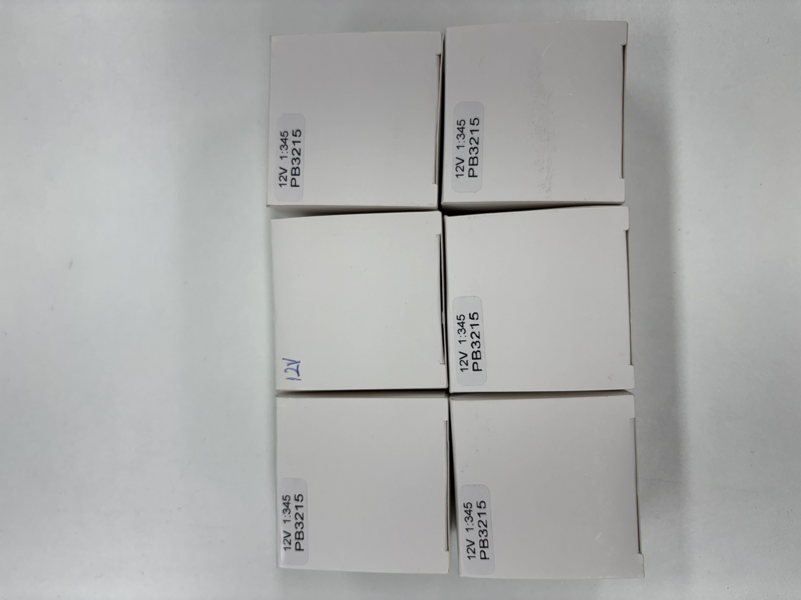
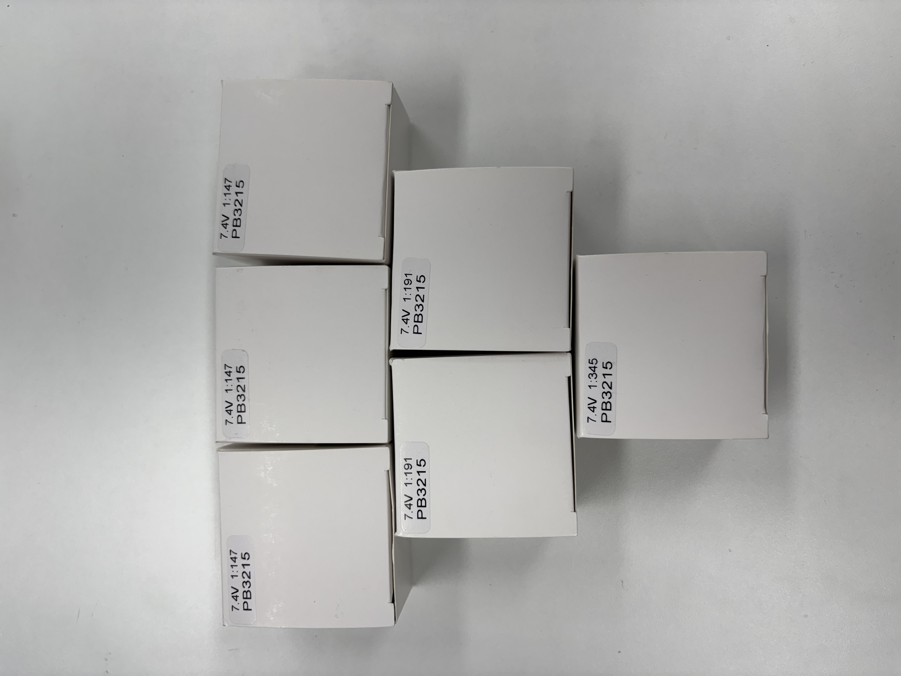
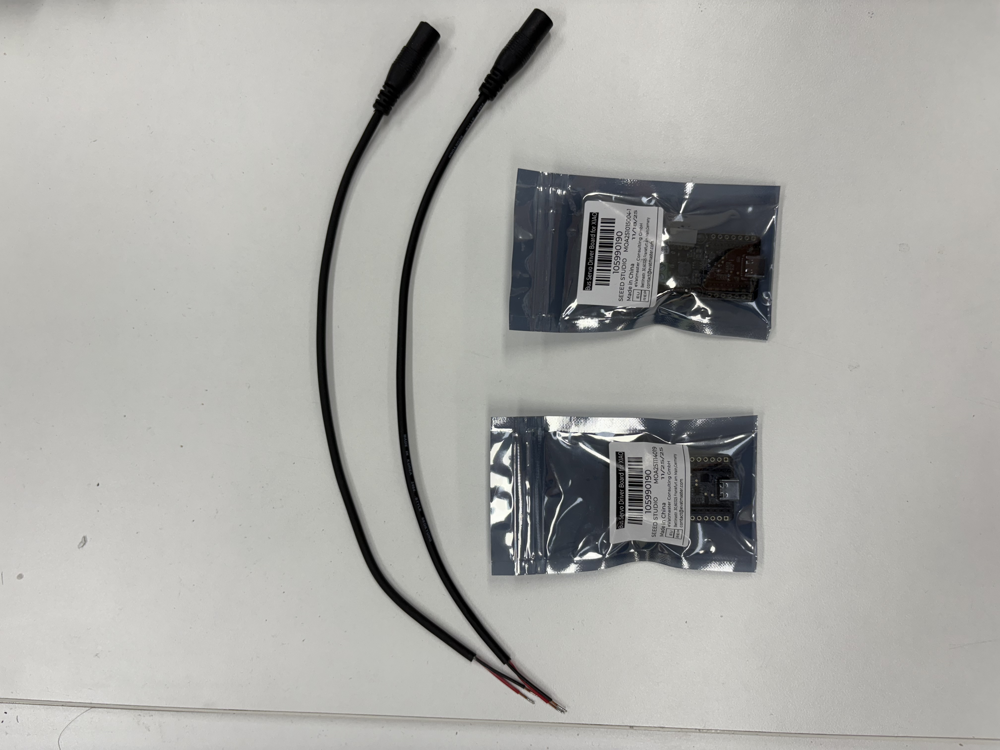

# \[29] SO-101: Overview & Assemble

## 관련 사이트











<figure><figcaption></figcaption></figure>

## 키트 부품 설명

* 부품 목록(BOM): 필요한 나사, 모터, 제어 보드 목록은 해당 페이지의 [README](https://github.com/TheRobotStudio/SO-ARM100/blob/main/README.md) 링크에서 확인할 수 있습니다.
* 3D 프린팅: 로봇의 프레임은 3D 프린터로 출력해야 합니다. (우린 구매)

### 팔로워: 서보 모터

**STS3215 모터12V 1:345 기어비**

<figure><figcaption></figcaption></figure>

### 리더: 서보 모터

| Leader-Arm Axis     | Motor | Gear Ratio |
| ------------------- | :---: | :--------: |
| Base / Shoulder Pan |   1   |   1 / 191  |
| Shoulder Lift       |   2   |   1 / 345  |
| Elbow Flex          |   3   |   1 / 191  |
| Wrist Flex          |   4   |   1 / 147  |
| Wrist Roll          |   5   |   1 / 147  |
| Gripper             |   6   |   1 / 147  |

<figure><figcaption></figcaption></figure>

### 서보 모터 상자 내부

<figure><figcaption></figcaption></figure>

### 서보 모터 컨트롤 보드

<figure><figcaption></figcaption></figure>

### 기타 부품

<figure><figcaption></figcaption></figure>

### 팔로워: 3D 프린터 부품

<figure><figcaption></figcaption></figure>

### 리더: 3D 프린터 부품

<figure><figcaption></figcaption></figure>

## 환경 설정 (조립 전)

### 르로봇 소프트웨어 설치



로봇을 제어하기 위해 컴퓨터에 LeRobot 라이브러리와 모터용 SDK를 설치해야 합니다. 추후 모든 명령어는 `lerobot` 폴더에서 입력하세요.

```bash
# 가상환경 생성
conda create -y -n lerobot python=3.10
conda activate lerobot
# dependency 설치
conda install ffmpeg -c conda-forge

# Install LeRobot
sudo apt-get install cmake build-essential python3-dev pkg-config libavformat-dev libavcodec-dev libavdevice-dev libavutil-dev libswscale-dev libswresample-dev libavfilter-dev
git clone https://github.com/huggingface/lerobot.git
cd lerobot
pip install -e ".[feetech]"
```

### USB포트 찾기

1. 리더암과 팔로워암의 컨트롤 보드를 PC에 연결한다 (C-to-USB)
2. 아래 명령어를 `lerobot` 폴더에서입력한 후 컨트롤 보드와 연결된 USB를 뺏다 꼽아 포트를 확인한다.

```bash
# usb port 찾는 명령어
lerobot-find-port

# 예시
팔로워 : The port of this MotorsBus is '/dev/ttyACM0'
리더 : The port of this MotorsBus is '/dev/ttyACM1'
```

3. **시리얼 넘버를 확인한다**

```bash
udevadm info -a -n /dev/ttyACM0 | grep serial
udevadm info -a -n /dev/ttyACM1 | grep serial
```

4. **규칙 파일 생성**

```bash
sudo nano /etc/udev/rules.d/99-lerobot-arms.rules

# .rules파일에 아래 내용 추가, serial을 자신의 환경에 맞게 변경
# LeRobot Follower Arm (Serial: 5AF7120792) -> /dev/ttyACM_FOLLOWER
SUBSYSTEM=="tty", ATTRS{serial}=="5AF7120792", SYMLINK+="ttyACM_FOLLOWER", MODE="0666"

# LeRobot Leader Arm (Serial: 5AF7173479) -> /dev/ttyACM_LEADER
SUBSYSTEM=="tty", ATTRS{serial}=="5AF7173479", SYMLINK+="ttyACM_LEADER", MODE="0666"
```

* **저장 방법:** `Ctrl + O` 누르고 `Enter`
* **나가기:** `Ctrl + X`

5. **규칙 적용 및 확인**

```bash
# 규칙 적용
sudo udevadm control --reload-rules && sudo udevadm trigger
# 확인
ls -l /dev/ttyACM_*

# 성공 시 출력 예시
lrwxrwxrwx 1 root root 7  1월  8 14:20 /dev/ttyACM_FOLLOWER -> ttyACM0
lrwxrwxrwx 1 root root 7  1월  8 14:20 /dev/ttyACM_LEADER -> ttyACM1
```


규칙 적용 후에는 `lerobot-find-port` 명령어가 동작하지 않습니다.


### 팔로워암: 서보 모터 ID 설정

**보드와 연결된 모터가 없도록 만든 후 아래 명령어를 입력한다.**

```jsx
# 팔로워암
lerobot-setup-motors --robot.type=so101_follower --robot.port=/dev/ttyACM_FOLLOWER
```

1. `Connect the controller board to the 'gripper' motor only and press enter.` 메시지가 나오면 해당모터와 보드만 3핀으로 연결한 후 엔터 입력 성공시 `'gripper' motor id set to 6` 출력
2. `Connect the controller board to the 'wrist_roll' motor only and press enter.` 메시지가 나오면 모터와 보드만 3핀으로 연결한 후 엔터 입력 성공시 `‘wrist_roll' motor id set to 5` 출력
3. `Connect the controller board to the 'wrist_flex' motor only and press enter.` 메시지가 나오면 모터와 보드만 3핀으로 연결한 후 엔터 입력 성공시 `‘wrist_flex' motor id set to 4` 출력
4. `Connect the controller board to the 'elbow_flex' motor only and press enter.` 메시지가 나오면 모터와 보드만 3핀으로 연결한 후 엔터 입력 성공시 `‘elbow_flex' motor id set to 3` 출력
5. `Connect the controller board to the 'shoulder_lift' motor only and press enter.` 메시지가 나오면 모터와 보드만 3핀으로 연결한 후 엔터 입력 성공시 `'shoulder_lift' motor id set to 2` 출력
6. `Connect the controller board to the 'shoulder_pan' motor only and press enter.` 메시지가 나오면 모터와 보드만 3핀으로 연결한 후 엔터 입력 성공시 `'shoulder_pan' motor id set to 1` 출력

### 리더암: 서보 모터 ID 설정

**보드와 연결된 모터가 없도록 만든 후 아래 명령어를 입력한다.**

```jsx
# 리더암
lerobot-setup-motors --teleop.type=so101_leader --teleop.port=/dev/ttyACM_LEADER
```

1. `Connect the controller board to the 'gripper' motor only and press enter.` 메시지가 나오면 모터와 보드만 3핀으로 연결한 후 엔터 입력 성공시 `'gripper' motor id set to 6` 출력
2. `Connect the controller board to the 'wrist_roll' motor only and press enter.` 메시지가 나오면 모터와 보드만 3핀으로 연결한 후 엔터 입력 성공시 `‘wrist_roll' motor id set to 5` 출력
3. `Connect the controller board to the 'wrist_flex' motor only and press enter.` 메시지가 나오면 모터와 보드만 3핀으로 연결한 후 엔터 입력 성공시 `‘wrist_flex' motor id set to 4` 출력
4. `Connect the controller board to the 'elbow_flex' motor only and press enter.` 메시지가 나오면 모터와 보드만 3핀으로 연결한 후 엔터 입력 성공시 `‘elbow_flex' motor id set to 3` 출력
5. `Connect the controller board to the 'shoulder_lift' motor only and press enter.` 메시지가 나오면 모터와 보드만 3핀으로 연결한 후 엔터 입력 성공시 `'shoulder_lift' motor id set to 2` 출력
6. `Connect the controller board to the 'shoulder_pan' motor only and press enter.` 메시지가 나오면 모터와 보드만 3핀으로 연결한 후 엔터 입력 성공시 `'shoulder_pan' motor id set to 1` 출력

## 조립



**위 사이트의 Clean Parts부분 참고.**
