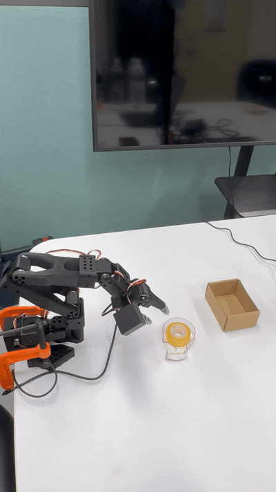

# \[31] SO-101: Train & Deploy ACT

## <mark style="color:$danger;">주의사항</mark>


이 문서는 로컬-서버 구조에서 작성된 것이 아니라 GPU가 장착되어 있는 로컬PC에서 학습과 추론이 모두 이루어지는 환경에서 작성되었습니다. 따라서 로컬-서버구조에서는 적용시킬때 변경이 필요합니다.


### 1. 학습 데이터셋 생성

#### 1단계: 허깅페이스(Hugging Face) 토큰 설정

Hugging Face 계정의 **`Settings > Tokens`**&#xC5D0; 접속하여 **Write** 권한이 있는 토큰을 생성하고 복사하세요.

1.  **터미널 로그인**: 아래 명령어를 입력하고 토큰을 붙여넣으세요.

    ```
    huggingface-cli login
    ```
2.  **사용자 ID 변수 저장**: 자신의 아이디가 정상적으로 출력되는지 확인합니다.

    ```
    HF_USER=$(hf auth whoami | head -n 1)
    echo $HF_USER
    # 본인의 아이디가 출력되면 성공!
    ```

#### 2단계: 데이터 수집 명령어 실행

* **저장소 이름**: `lerobot-dataset`
* 에피소드 수: 10 (테스트용으로 10번만)
* **임무**: "Pick up the Scotch tape and place it in the brown box"
* **카메라 설정**: 전면(index 2), 상단(index 0) \
  -> 확인된 카메라 인덱스를 넣어주세요.
* `${HF_USER}`를 자신의 허깅페이스 아이디로 변경

```
lerobot-record \
    --robot.type=so101_follower \
    --robot.port=/dev/ttyACM_FOLLOWER \
    --robot.id=my_follower \
    --robot.cameras="{ front: {type: opencv, index_or_path: 2, width: 640, height: 480, fps: 30}, top: {type: opencv, index_or_path: 0, width: 640, height: 480, fps: 30}}" \
    --teleop.type=so101_leader \
    --teleop.port=/dev/ttyACM_LEADER \
    --teleop.id=my_leader \
    --display_data=true \
    --dataset.repo_id=${HF_USER}/lerobot-dataset \
    --dataset.num_episodes=10 \
    --dataset.single_task="Pick up the Scotch tape and place it in the brown box"
```

#### 3단계: 녹화 조작 방법 (중요 🔑)

명령어를 실행하면 카메라 프리뷰 화면이 뜨고 준비 상태가 됩니다.

1. **시작**: 준비 완료 시 로봇이 초기 위치로 이동합니다.
2. **녹화 중**: 리더암을 움직여 실제 태스크를 수행하세요.
3. **에피소드 저장(성공 시)**: \
   \- 👉 오른쪽 화살표 키 (→)를 누르세요.\
   \- 현재 에피소드가 저장되고, 로봇이 초기 위치로 돌아가며 다음 에피소드를 준비합니다.
4. **에피소드 삭제(실패 시)**: \
   \- 👈 왼쪽 화살표 키 (←)를 누르세요.\
   \- 방금 찍은 건 삭제되고, 다시 찍을 수 있게 리셋됩니다.
5. **종료 및 업로드**: \
   &#xNAN;**`ESC` 키**를 누르면 중단되고 허깅페이스로 업로드가 시작됩니다.

> **안전 주의**: 에피소드가 끝나면 로봇이 자동으로 Reset 동작(초기 위치 이동)을 합니다. 이때 로봇 관절에 손이 끼이지 않도록 주의하세요!

### 2. 문제 해결 및 팁

#### 💡 꿀팁 & 주의사항

* **카메라 확인**: `display_data=true` 화면을 보며 손이 물체를 가리지 않는지 확인하세요.
* **업로드 확인**: 10번을 다 채우거나 ESC를 누르면, 터미널에 업로드 진행바가 뜰 겁니다. 업로드가 끝나면 허깅페이스 본인 계정 페이지에서 데이터셋을 볼 수 있습니다.

#### 🛠️ Troubleshooting

1.  **Numpy 관련 에러**:

    ```
    pip install "numpy<2.0" wrapt
    ```
2.  **FileExistsError (캐시 충돌)**: 이미 존재하는 데이터셋 경로와 충돌할 경우, `.cache` 폴더 내의 해당 경로를 삭제해야 합니다.

    ```
    # 예시 에러: FileExistsError: [Errno 17] File exists: '/home/user/.cache/huggingface/lerobot/...'
    ```

### 3. 데이터 검증 및 확인

<figure><figcaption></figcaption></figure>

#### 4단계: 업로드 확인 및 수동 업로드

만약 자동 업로드가 실패했다면 아래 명령어로 수동 업로드할 수 있습니다.

```
# 데이터가 잘 저장되어 있는지 확인 (폴더 체크) 먼저 내 컴퓨터에 데이터가 있는지 확인합니다.
ls -d ~/.cache/huggingface/lerobot/${HF_USER}/lerobot-dataset

# 수동 업로드
huggingface-cli upload ${HF_USER}/lerobot-dataset ~/.cache/huggingface/lerobot/${HF_USER}/lerobot-dataset --repo-type dataset
```

#### 5단계: 데이터셋 기반 리플레이

수집된 데이터가 올바른지 팔로워암을 통해 다시 확인해 봅니다.

```
lerobot-replay \
    --robot.type=so101_follower \
    --robot.port=/dev/ttyACM_FOLLOWER \
    --robot.id=my_follower \
    --dataset.repo_id=${HF_USER}/lerobot-dataset \
    --dataset.episode=0
```

### 4. 모델 학습 (Training)

`wandb` 로그인을 통해 학습 과정을 모니터링할 수 있습니다. \
(이미 로그인되어 있다면 스킵)

```
wandb login
# 복사한 API KEY 입력
```

**ACT 알고리즘 학습 실행**:

```
lerobot-train \
  --dataset.repo_id=${HF_USER}/lerobot-dataset \
  --policy.type=act \
  --output_dir=outputs/train/act_so101_test \
  --job_name=act_so101_test \
  --policy.device=cuda \
  --wandb.enable=true \
  --policy.repo_id=false \
  --batch_size=16 \
  --steps=10000
```

**학습 완료 후 파일 구조 확인:**

학습이 정상적으로 완료되면 `outputs/train/act_so101_test` 폴더에 다음과 같은 핵심 파일들이 생성됩니다.

```

outputs/train/act_so101_test
├── checkpoints
│   ├── 010000 (설정한 step 수)
│   │   └── pretrained_model
│   │       ├── model.safetensors (학습된 가중치)
│   │       ├── config.json (모델 설정)
│   │       └── train_config.json (학습 당시 파라미터 정보)
│   └── last -> 010000 (가장 최신 체크포인트를 가리키는 심볼릭 링크)
└── wandb (학습 로그 데이터)
```

* **last/pretrained\_model**: 추론 단계에서 로봇을 움직일 때 참조하게 되는 가장 중요한 폴더입니다.

### 5. 추론 및 배포

학습된 모델을 사용하여 로봇이 스스로 동작하게 합니다.

```
lerobot-record \
  --robot.type=so101_follower \
  --robot.port=/dev/ttyACM_FOLLOWER \
  --robot.id=my_follower \
  --robot.cameras="{ front: {type: opencv, index_or_path: 2, width: 640, height: 480, fps: 30}, top: {type: opencv, index_or_path: 0, width: 640, height: 480, fps: 30}}" \
  --display_data=true \
  --dataset.repo_id=${HF_USER}/eval_so101_test \
  --dataset.single_task="Pick up the Scotch tape and place it in the brown box" \
  --dataset.num_episodes=5 \
  --dataset.episode_time_s=50 \
  --dataset.push_to_hub=false \
  --policy.path=outputs/train/act_so101_test/checkpoints/last/pretrained_model \
  --policy.device=cuda
```

> **중요**: 추론을 실행하기 전, `~.cache/huggingface/lerobot/` 폴더 내에 `dataset.repo_id`로 설정한 이름과 동일한 폴더가 미리 존재하지 않아야 합니다. (충돌 방지)

## 동작 예시 (ACT)

<figure><figcaption></figcaption></figure>

